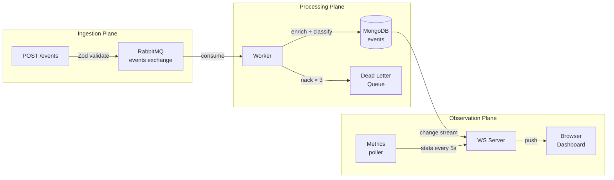

# EventHorizon

EventHorizon is a **real-time event pipeline** — you send telemetry events in, they get validated, queued, processed, stored, and pushed live to a browser dashboard. All within a second or two of arriving.

It's a **hands-on demo** of backend distributed systems patterns: message queues, change streams, WebSockets, idempotent storage, and graceful shutdown. The fake telemetry domain is just scaffolding — the interesting part is how the pieces are wired together.

---

> **For the technically curious:** this is a *Reactive Data Plane* — four explicit processing stages (Ingestion → Processing → Storage → Observation) connected by RabbitMQ and MongoDB. Data flows one direction only. Each stage is independently deployable and horizontally scalable.

---

Ingest fake telemetry events → validate → queue → worker enriches → store append-only → change stream → WebSocket → live dashboard.

## 🚀 Quick Start

```bash
# 1. Start infrastructure
npm run infra
# MongoDB on :27017 | RabbitMQ on :5672 | Management UI on :15672 (guest/guest)

# 2. Copy env
cp .env.example .env

# 3. Install deps
npm install

# 4. Start server
npm run dev

# 5. In a separate terminal, generate fake events
npm run seed -- --rate=2 --type=all

# 6. Open dashboard
open http://localhost:3000/dashboard
```

## 🏗️ Architecture Overview



## 🧰 Stack

| Layer | Tech | Notes |
|---|---|---|
| Language | TypeScript (strict) | `NodeNext` module resolution |
| Framework | Fastify | High throughput, schema hooks |
| Message broker | RabbitMQ 3 | Topic exchange + DLX dead-letter pattern |
| Database | MongoDB 7 | Append-only event log + change streams |
| Real-time | WebSockets (`@fastify/websocket`) | Raw WS — no socket.io |
| Validation | Zod | Shared boundary contract across all layers |
| Testing | Vitest + mongodb-memory-server | ESM-native, colocated tests |

## 📚 Docs

| File | Contents |
|---|---|
| [ARCHITECTURE.md](docs/ARCHITECTURE.md) | Layer design, data flow, RabbitMQ topology |
| [SERVICES.md](docs/SERVICES.md) | Per-module reference |
| [API.md](docs/API.md) | HTTP + WebSocket routes |
| [DEV_GETTING_STARTED.md](docs/DEV_GETTING_STARTED.md) | Full local setup walkthrough |
| [TESTING.md](docs/TESTING.md) | Test strategy, what's covered and what isn't |
| [DECISION_LOG.md](docs/DECISION_LOG.md) | Why each technology was chosen |

## 🗂️ Project Structure

```
src/
  config.ts                     # Env vars parsed/validated via Zod
  server.ts                     # Fastify entry + graceful shutdown

  ingestion/                    # ── Ingestion Plane ──
    event.schema.ts             # Zod discriminated union + inferred types
    event.routes.ts             # POST /events, GET /events, GET /events/:id

  processing/                   # ── Processing Plane ──
    queue.ts                    # RabbitMQ connection, exchange/queue setup
    worker.ts                   # Consumer: ack/nack, retry, DLQ
    processors/
      enrich.ts                 # Add receivedAt, enrichedAt, source metadata
      classify.ts               # Classify: normal | warning | critical

  storage/                      # ── Storage Plane ──
    db.ts                       # MongoDB client + connection
    event.repository.ts         # Append-only repo, idempotent insert

  observation/                  # ── Observation Plane ──
    changeStream.ts             # MongoDB change stream → async iterable
    wsServer.ts                 # WebSocket connection manager
    metrics.ts                  # Rolling stats, lag, distribution

  dashboard/
    index.html                  # Single-file live dashboard (vanilla JS)

  seed/
    producer.ts                 # CLI fake event generator
```

## 📦 npm Scripts

| Script | Description |
|---|---|
| `npm run dev` | Start Fastify server with tsx |
| `npm run worker` | Start RabbitMQ consumer worker |
| `npm run seed` | Run fake event generator CLI |
| `npm run infra` | `docker compose up -d` |
| `npm run infra:down` | `docker compose down` |
| `npm test` | Run Vitest suite |
| `npm run test:watch` | Vitest in watch mode |
| `npm run typecheck` | `tsc --noEmit` |

## 🧠 TS Patterns Practiced

- Discriminated unions for event types (`pipeline` | `sensor` | `app`)
- `z.infer<typeof Schema>` — no type duplication across layers
- Generic repository pattern over MongoDB collections
- Typed async iterators (MongoDB change streams as `AsyncIterable`)
- Typed AMQP message payloads across publish/consume boundary
- Strict null safety across async flows

## 🗺️ Roadmap

### ✅ Phase 1 — Foundation
- [x] Project scaffold, tsconfig, docker-compose
- [x] Documentation + AI context files (CLAUDE.md, copilot-instructions.md)
- [x] `src/config.ts` — env validation via Zod
- [x] `src/ingestion/event.schema.ts` — discriminated union types

### ✅ Phase 2 — Entry Point + Ingestion (current)
- [x] `src/server.ts` — Fastify app, signal handling, graceful shutdown skeleton
- [x] `src/ingestion/event.routes.ts` — POST /events, Zod validation, 202 Accepted
- [x] `src/processing/queue.ts` (stub) — `publishEvent` placeholder

### ✅ Phase 3 — Message Broker
- [x] `src/processing/queue.ts` — RabbitMQ topology + real `publishEvent()`
- [x] `src/processing/worker.ts` + `processors/enrich.ts` + `processors/classify.ts`

### ✅ Phase 4 — Storage Plane
- [x] `src/storage/db.ts` — MongoDB client connection
- [x] `src/storage/event.repository.ts` — idempotent inserts, duplicate key handling

### ✅ Phase 5 — Observation Plane
- [x] `src/observation/changeStream.ts` — MongoDB change stream, callback-based push
- [x] `src/observation/wsServer.ts` — WebSocket connection manager + broadcast
- [x] `src/observation/metrics.ts` — rolling stats, lag, type distribution

### 🚧 Phase 6 — Dashboard + Seed
- [x] `src/seed/producer.ts` — CLI fake event generator
- [x] `src/dashboard/index.html` — live feed, stats bar, event detail (vanilla JS)
