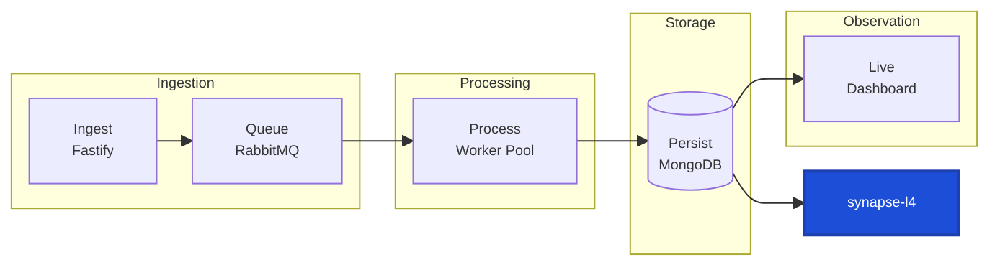
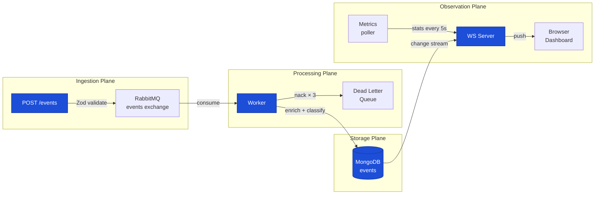

<p align="center">
    
</p>


EventHorizon is a real-time **telemetry and data streaming pipeline**. It processes live event data—like sensor readings or system metrics—and pushes it to a live browser dashboard in under a second.

Architecturally, this project is a production-grade blueprint for a **Reactive Data Plane**. It demonstrates how to connect four decoupled processing stages (Ingestion → Processing → Storage → Observation) using asynchronous message queues, change data capture, and end-to-end distributed tracing.

---


```mermaid
%%{init: {'themeVariables': {'fontSize': '10px'}, 'flowchart': {'nodeSpacing': 15, 'rankSpacing': 25}}}%%
flowchart LR
    subgraph Ingestion
        A[Ingest<br/>Fastify] --> B[Queue<br/>RabbitMQ]
    end
    subgraph Processing
        C[Process<br/>Worker Pool]
    end
    subgraph Storage
        D[(Persist<br/>MongoDB)]
    end
    subgraph Observation
        E[Live<br/>Dashboard]
    end
    B --> C
    C --> D
    D --> E
    D --> F[synapse-l4]

    click F "https://github.com/obrienma/synapse-l4#readme" "Go to synapse-l4 repo"

    classDef clickable fill:#1d4ed8,stroke:#1e40af,stroke-width:2px,color:#ffffff
    class F clickable
```

---

<p align="center">
  
</p>


## 📋 Contents

- [📋 Contents](#-contents)
- [🧰 Stack](#-stack)
- [🚀 Running the Project](#-running-the-project)
  - [✅ Prerequisites](#-prerequisites)
  - [⚡ Quick Start](#-quick-start)
  - [📦 npm Scripts](#-npm-scripts)
- [🏗️ Architecture](#️-architecture)
  - [🔀 Pipeline Diagram](#-pipeline-diagram)
  - [🗂️ Operational Planes](#️-operational-planes)
  - [📐 Scale Design](#-scale-design)
  - [🧩 TypeScript Patterns](#-typescript-patterns)
- [🔭 Observability](#-observability)
  - [🔍 Overview](#-overview)
  - [📊 Grafana Dashboard](#-grafana-dashboard)
- [📚 Docs](#-docs)
- [🗺️ Roadmap](#️-roadmap)
  - [📋 Planned](#-planned)
  - [📦 Production-Ready Baseline](#-production-ready-baseline)
    - [🔧 Core Engine \& Broker (Phases 1–3)](#-core-engine--broker-phases-13)
    - [🎛️ Data, Storage \& UI (Phases 4–6)](#️-data-storage--ui-phases-46)
    - [🧪 Test Architecture (Phases 7–9)](#-test-architecture-phases-79)
    - [🛡️ Resiliency \& Packaging (Phases 10–12)](#️-resiliency--packaging-phases-1012)
    - [🌐 Orchestration \& Telemetry (Phases 13–15)](#-orchestration--telemetry-phases-1315)
    - [💎 Hardening \& Final Polishing (Phases 16–19)](#-hardening--final-polishing-phases-1619)


## 🧰 Stack

The EventHorizon engine is built on a modern, decoupled stack grouped by operational domain.

**🚀 Core Engine & Ingestion**

- **TypeScript (Strict):** Configured with modern `NodeNext` module resolution for ESM-native dependency execution.
- **Fastify:** Chosen for its high-throughput design, low overhead, and native support for asynchronous route hooks.
- **Zod:** Establishes shared boundary validation contracts across all API entry points and data interfaces.

**⚡ Data Flow & Persistence**

- **RabbitMQ 3:** Implements a robust topic exchange topology featuring an explicit 3x-nack Dead Letter Queue (DLQ) retry pipeline for bulletproof stream buffering.
- **MongoDB 7:** Configured as an append-only event store, optimized with Change Streams to drive real-time downstream push reactivity.

**👁️ Real-Time & Observability**

- **WebSockets (`@fastify/websocket`):** A lightweight, native real-time connection layer avoiding heavy framework abstractions.
- **OpenTelemetry:** Bootstraps distributed tracing and custom metrics using wide spans across process boundaries with native OTLP export.

**🧪 Engineering & Test Tooling**

- **Vitest:** An ESM-native test runner optimized for fast, colocated tests and high performance.
- **mongodb-memory-server:** Provides completely isolated, ephemeral database instances for reliable, zero-leak integration tests.


## 🚀 Running the Project

### ✅ Prerequisites

- **Node.js 20+**
- **Docker** — required for `npm run infra` (MongoDB + RabbitMQ)

> [!NOTE]
> Tested on **WSL2 (Windows)** and **Railway**. Other environments may work but are untested.

### ⚡ Quick Start

```bash
# 1. Start infrastructure
npm run infra
# MongoDB on :27017 | RabbitMQ on :5672 | Management UI on :15672 (guest/guest)

# 2. Copy env
cp .env.example .env

# 3. Install deps
npm install

# 4. Start server
npm run dev

# 5. In a separate terminal, start the worker (consumes + processes events)
npm run worker

# 6. In a third terminal, generate fake events
npm run seed -- --rate=2 --type=all

# 7. Open dashboard
open http://localhost:3000/dashboard

```

### 📦 npm Scripts

| Script | Description |
| --- | --- |
| `npm run dev` | Start Fastify server with tsx |
| `npm run worker` | Start RabbitMQ consumer worker |
| `npm run seed` | Run fake event generator CLI |
| `npm run infra` | `docker compose up -d` |
| `npm run infra:down` | `docker compose down` |
| `npm test` | Run Vitest suite |
| `npm run test:watch` | Vitest in watch mode |
| `npm run build` | Compile to `dist/` (production, no test files) |
| `npm run typecheck` | `tsc --noEmit` |


## 🏗️ Architecture

### 🔀 Pipeline Diagram


```mermaid
flowchart LR
    subgraph Ingestion Plane
        A[POST /events] -->|Zod validate| B[RabbitMQ<br/>events exchange]
    end

    subgraph Processing Plane
        B -->|consume| C[Worker]
        C -->|nack × 3| E[Dead Letter<br/>Queue]
    end

    subgraph Storage Plane
        D[(MongoDB<br/>events)]
    end

    subgraph Observation Plane
        F[WS Server]
        F -->|push| G[Browser<br/>Dashboard]
        H[Metrics<br/>poller] -->|stats every 5s| F
    end

    C -->|enrich + classify| D
    D -->|change stream| F

    click A "https://github.com/obrienma/EventHorizon/tree/master/src/ingestion/" "Go to Ingestion Source"
    click C "https://github.com/obrienma/EventHorizon/tree/master/src/processing/" "Go to Processing Source"
    click D "https://github.com/obrienma/EventHorizon/tree/master/src/storage/" "Go to Storage Source"
    click F "https://github.com/obrienma/EventHorizon/tree/master/src/observation/" "Go to Observation Source"

    classDef clickable fill:#1d4ed8,stroke:#1e40af,stroke-width:2px,color:#ffffff
    class A,C,D,F clickable
```

### 🗂️ Operational Planes

The codebase is organized into four operational planes, separating ingestion from downstream processing and observation.

| Operational Plane | Key Components & Files | Purpose & Responsibilities |
| :--- | :--- | :--- |
| **🚀 Ingestion** | `src/ingestion/` <br> `src/server.ts` | **Entry & Validation:** Handles the Fastify entry point, **graceful shutdown** orchestration, and strict request schema verification via **Zod discriminated unions**. |
| **⚡ Processing** | `src/processing/` <br> `src/processing/processors/` | **Message Broker:** Manages **RabbitMQ topology bindings**, consumer logic, **backpressure handling**, and modular event pipelines (`enrich`, `classify`). |
| **💾 Storage** | `src/storage/` | **Persistence:** Controls the MongoDB client tier and features append-only repositories utilizing **idempotent write strategies**. |
| **👁️ Observation** | `src/observation/` <br> `src/health.routes.ts` | **Telemetry & Streaming:** Manages **OTel tracing spans**, live WebSockets, rolling metrics, **durable change stream resumption**, and health probes. |
| **📦 Deployment** | `k3s/` <br> `Dockerfile` | **Orchestration:** Multi-stage container builds and decoupled Kubernetes manifests (Namespace, ConfigMap, Secret, Server, and Replicated Workers). |
| **🛠️ Tools** | `src/dashboard/` <br> `src/seed/` | **Simulation & UI:** Standalone CLI **load generation seed tools** and a lightweight real-time monitoring dashboard frontend. |

### 📐 Scale Design

> [!NOTE]
> Because the storage layer implements an **idempotent repository layout**, the `processing/` plane can safely scale horizontally (e.g., `replicas: 2` in k3s manifests via the **Competing Consumers pattern**) with zero risk of data corruption or duplication.

### 🧩 TypeScript Patterns

* Discriminated unions for event types (`pipeline` | `sensor` | `app`)
* `z.infer<typeof Schema>` — no type duplication across layers
* Generic repository pattern over MongoDB collections
* Typed async iterators (MongoDB change streams as `AsyncIterable`)
* Typed AMQP message payloads across publish/consume boundary
* Strict null safety across async flows


## 🔭 Observability

### 🔍 Overview

> Distributed tracing is optional — point `OTEL_EXPORTER_OTLP_ENDPOINT` at a running OTel Collector to see traces. The SDK no-ops silently if no collector is reachable.

The **built-in dashboard** (`/dashboard`) is a WebSocket-fed live event feed — raw throughput and pipeline stats updated in real time. For deeper visibility, EventHorizon is also instrumented with OpenTelemetry and emits traces and metrics to a companion **[Grafana monitoring stack](https://github.com/obrienma/rhizome-observability#readme)** — service health, distributed traces, and failure signals the HTTP response can't surface. (Log shipping to Loki is a planned next step; for now logs stay on the console.) In practice the Grafana layer means:

* **One trace per event, end to end.** A single event is followed across the whole pipeline, even across process boundaries — so when something is slow or breaks, you can see exactly where.
* **A live dashboard.** Service health and what the pipeline is doing, at a glance — and the underlying traces are one click away for drill-down. Screenshot below.
* **Failures the response can't show.** Events are processed after the request comes back, so a request can succeed and still fail later — those failures are tracked too, never hidden.
* **Fault injection for demos.** Optional flags inject real errors so the dashboard's error panels have realistic traffic to show — off by default.

### 📊 Grafana Dashboard

> [!TIP]
> Errors shown are synthetic — generated via opt-in fault injection for dashboard demo traffic.

<p align="center">
  
</p>


## 📚 Docs

_Dates below confirmed 2026-06-17_
| File | Contents | Last updated | Verified |
| --- | --- | --- | --- |
| [README.md](README.md) | Project overview | 2026-06-17 | 2026-06-17 |
| [ARCHITECTURE.md](docs/ARCHITECTURE.md) | Layer design, data flow, RabbitMQ topology | 2026-06-17 | 2026-06-17 |
| [SERVICES.md](docs/SERVICES.md) | Per-module reference | 2026-06-14 | 2026-06-14 |
| [API.md](docs/API.md) | HTTP + WebSocket routes | 2026-06-14 | 2026-06-14 |
| [DEV_GETTING_STARTED.md](docs/DEV_GETTING_STARTED.md) | Full local setup walkthrough | 2026-06-14 | 2026-06-14 |
| [TESTING.md](docs/TESTING.md) | Test strategy, what's covered and what isn't | 2026-06-14 | 2026-06-14 |
| [USER_STORIES.md](docs/USER_STORIES.md) | What each persona needs, mapped to the code that delivers it | 2026-06-15 | 2026-06-14 |
| [diagrams/OVERVIEW.md](docs/diagrams/OVERVIEW.md) | Architecture diagrams | 2026-06-14 | 2026-06-14 |
| [adr/](docs/adr/) | Architecture Decision Records | 2026-06-17 | — |
| [journal.md](docs/journal.md) | Engineering journal — one entry per phase | 2026-06-15 | — |

## 🗺️ Roadmap

### 📋 Planned

* [ ] **Log Shipping (Loki):** Introduce structured logging and ship logs to Loki via OTel Collector. Correlate trace IDs to log lines inside Grafana queries. Logger choice and migration scope TBD — ADR pending.
* [ ] **Alerting:** Grafana alert rules on existing custom OTel metrics (`events_failed_total`, `change_stream_lag`) — no new instrumentation required.
* [ ] **GitHub Actions — Journal Publishing:** Pipeline to publish engineering journal entries to a personal website (private repo). The same pattern scales to an enterprise developer portal (e.g. Backstage).
* [ ] **Helm Chart:** Package the existing k3s raw YAML manifests as a Helm chart for portable, parameterised deployment.

## 🐛 Known issues

- [ ] **Deterministic parse failures retry needlessly** (EventHorizon):
      malformed/schema-invalid messages go through 3 retries before
      dead-lettering despite being unfixable by retry.
- [ ] **Unclear ingestion failure status** (EventHorizon): `publishEvent`
      throwing (RabbitMQ down) falls through to a generic 500; decide if 503
      is more correct.
- [ ] **No backpressure drain handling** (EventHorizon): `channel.publish()`
      returning `false` is logged but not acted on.

### 📦 Production-Ready Baseline

* **Phases 1–6 (Core Ingestion & Storage):** Fastify app, Zod boundaries, RabbitMQ topology, and MongoDB idempotent persistence layer.
* **Phases 7–12 (Testing & Resiliency):** Integrated mock execution, backpressure flow handling, and resume-token change stream checkpoints.
* **Phases 13–19 (Orchestration & Telemetry):** Multi-stage container builds, replicated K3s manifests (Competing Consumers), and OpenTelemetry tracing spans.

> [!TIP]
> **19 Architectural Phases Completed** | **44/44 Tests Passing (100% Green)**

<details>
<summary>🔍 View phase-by-phase implementation history...</summary>

#### 🔧 Core Engine & Broker (Phases 1–3)
* **Phase 1 — Foundation:** Project scaffold, tsconfig, docker-compose, environment validation via Zod, and discriminated union schemas.
* **Phase 2 — Entry Point + Ingestion:** Fastify app setup, signal handling, graceful shutdown skeleton, and validation on `POST /events`.
* **Phase 3 — Message Broker:** Realized RabbitMQ topology configurations alongside robust worker and processor pipelines (`enrich`, `classify`).

#### 🎛️ Data, Storage & UI (Phases 4–6)
* **Phase 4 — Storage Plane:** MongoDB client connections paired with idempotent inserts to absorb duplicate key handling.
* **Phase 5 — Observation Plane:** Implemented MongoDB change streams, a WebSocket connection manager for live broadcasting, and rolling performance metrics.
* **Phase 6 — Dashboard + Seed:** Completed a CLI fake event generator script and a live metrics web frontend dashboard.

#### 🧪 Test Architecture (Phases 7–9)
* **Phase 7 — Processor & Integration Tests:** Unit specs for core processors and route testing using Fastify `inject()` + `vi.mock`.
* **Phase 8 — Data Isolation & Timers:** Isolated repository verification via `mongodb-memory-server` and `vi.useFakeTimers` for metrics.
* **Phase 9 — Worker Path Hardening:** Exhaustive verification covering worker ack, nack, retries, and dead-letter queue (DLQ) execution blocks.

#### 🛡️ Resiliency & Packaging (Phases 10–12)
* **Phase 10 — Flow Control:** Handled `ch.publish()` return states to eliminate silent message drops under backpressure; threaded `messageId` through retries.
* **Phase 11 — Durable Resume Token:** Persisted change stream checkpoint tokens directly to MongoDB to handle safe pod restarts without event loss.
* **Phase 12 — Dockerfile:** Optimized a multi-stage production Docker image down to a lean ~181 MB runtime run under a non-root profile.

#### 🌐 Orchestration & Telemetry (Phases 13–15)
* **Phase 13 — Health Check:** Created deep sub-service infrastructure pinging at `GET /healthz` for K3s liveness and readiness probes.
* **Phase 14 — Kubernetes Deployment (k3s):** Authored standard, highly portable Kubernetes manifests. Configured replicated workers utilizing a Competing Consumers pattern backed by storage-layer idempotency.
* **Phase 15 — Distributed Tracing (OpenTelemetry):** Bootstrapped the OpenTelemetry SDK with wide spans across all layers and handled W3C trace context propagation across the RabbitMQ boundary.

#### 💎 Hardening & Final Polishing (Phases 16–19)
* **Phases 16–18 — Observability Hardening:** Validated full metrics/trace lifecycles directly against a Grafana stack (Tempo + Prometheus) and added custom OTel metrics for stream lag.
* **Phase 19 — Test Suite Completion:** Cleared intentional-friction TODO placeholders and resolved critical type distribution bugs using `DistributiveOmit` in test helpers (44/44 tests green; clean `tsc --noEmit`).

</details>

