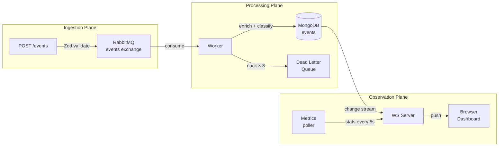

# EventHorizon

_Last updated: 2026-06-14 · Verified against `src/`: 2026-06-14_

EventHorizon is a **real-time event pipeline** — you send telemetry events in, they get validated, queued, processed, stored, and pushed live to a browser dashboard. All within a second or two of arriving.

It's a **hands-on demo** of backend distributed systems patterns: message queues, change streams, WebSockets, idempotent storage, and graceful shutdown. The telemetry domain is just scaffolding — the interesting part is how the pieces are wired together.

---

> **For the technically curious:** this is a *Reactive Data Plane* — four explicit processing stages (Ingestion → Processing → Storage → Observation) connected by RabbitMQ and MongoDB. Data flows one direction only. Each stage is independently deployable and horizontally scalable.

---

Ingest telemetry events → validate → queue → worker enriches → store append-only → change stream → WebSocket → live dashboard.


## 🧰 Stack

| Layer | Tech | Notes |
|---|---|---|
| Language | TypeScript (strict) | `NodeNext` module resolution |
| Framework | Fastify | High throughput, schema hooks |
| Message broker | RabbitMQ 3 | Topic exchange + DLX dead-letter pattern |
| Database | MongoDB 7 | Append-only event log + change streams |
| Real-time | WebSockets (`@fastify/websocket`) | Raw WS — no socket.io |
| Validation | Zod | Shared boundary contract across all layers |
| Observability | OpenTelemetry tracing | Wide spans on all four planes, OTLP export |
| Testing | Vitest + mongodb-memory-server | ESM-native, colocated tests |


## 🏗️ Architecture Overview


```mermaid
flowchart LR
    subgraph Ingestion Plane
        A[POST /events] -->|Zod validate| B[RabbitMQ\nevents exchange]
    end

    subgraph Processing Plane
        B -->|consume| C[Worker]
        C -->|enrich + classify| D[(MongoDB\nevents)]
        C -->|nack × 3| E[Dead Letter\nQueue]
    end

    subgraph Observation Plane
        D -->|change stream| F[WS Server]
        F -->|push| G[Browser\nDashboard]
        H[Metrics\npoller] -->|stats every 5s| F
    end
```

## 🔭 Observability

Every request is traced with OpenTelemetry — `NodeSDK` + `auto-instrumentations-node` export traces, metrics, and trace-correlated logs via OTLP to a [Tempo/Loki/Prometheus/Grafana stack](https://github.com/obrienma/rhizome-observability).

- **Cross-process trace propagation**: a single trace follows one event across process boundaries — HTTP ingest (SERVER) → RabbitMQ publish (PRODUCER) → RabbitMQ consume (CONSUMER) → `event.process` (CONSUMER, with `event.type`/`classification`/`write.collection` attributes) — via W3C `traceparent` headers injected/extracted around the AMQP boundary.
- **Live dashboard**: the "EventHorizon Service" Grafana dashboard shows request rate, 5xx error rate, p50/p95/p99 latency, MongoDB connection pool, Node.js event-loop lag, V8 heap, and a recent-traces table — all sourced from auto-instrumentation metrics and TraceQL, zero extra instrumentation code.
- **Trace waterfall**: `Explore → Tempo → {resource.service.name="event-horizon"}` in Grafana shows the full four-span trace for any request.
- **Fault injection (demo only)**: `CHAOS_ERROR_RATE` (server env var, default `0`) injects real 500s; `npm run seed -- --error-rate=0.1` sends events with an invalid `id` to trigger real 422s — both for exercising the dashboard's error-rate panels with realistic mixed-status traffic.

## 📚 Docs

| File | Contents |
|---|---|
| [ARCHITECTURE.md](docs/ARCHITECTURE.md) | Layer design, data flow, RabbitMQ topology |
| [SERVICES.md](docs/SERVICES.md) | Per-module reference |
| [API.md](docs/API.md) | HTTP + WebSocket routes |
| [DEV_GETTING_STARTED.md](docs/DEV_GETTING_STARTED.md) | Full local setup walkthrough |
| [TESTING.md](docs/TESTING.md) | Test strategy, what's covered and what isn't |
| [DECISION_LOG.md](docs/DECISION_LOG.md) | Why each technology was chosen |
| [USER_STORIES.md](docs/USER_STORIES.md) | What each persona needs, mapped to the code that delivers it |

## 🗂️ Project Structure

```
src/
  config.ts                     # Env vars parsed/validated via Zod
  server.ts                     # Fastify entry + graceful shutdown

  ingestion/                    # ── Ingestion Plane ──
    event.schema.ts             # Zod discriminated union + inferred types
    event.routes.ts             # POST /events, GET /events, GET /events/:id

  processing/                   # ── Processing Plane ──
    queue.ts                    # RabbitMQ connection, exchange/queue setup
    worker.ts                   # Consumer: ack/nack, retry, DLQ
    processors/
      enrich.ts                 # Add receivedAt, enrichedAt, source metadata
      classify.ts               # Classify: normal | warning | critical

  storage/                      # ── Storage Plane ──
    db.ts                       # MongoDB client + connection
    event.repository.ts         # Append-only repo, idempotent insert

  observation/                  # ── Observation Plane ──
    changeStream.ts             # Change stream with resume token + backoff
    checkpoint.ts               # Persists resume token to MongoDB (pod-restart safe)
    wsServer.ts                 # WebSocket connection manager + broadcast
    metrics.ts                  # Rolling stats, lag, type distribution
    tracing.ts                  # OpenTelemetry SDK bootstrap + wide-span helpers

  health.routes.ts              # GET /healthz — MongoDB ping for k3s probes

  dashboard/
    index.html                  # Single-file live dashboard (vanilla JS)

  seed/
    producer.ts                 # CLI fake event generator

k3s/
  namespace.yaml
  configmap.yaml
  secret.yaml                   # Template — replace values before applying
  server.yaml                   # Deployment + NodePort Service
  worker.yaml                   # Deployment (replicas: 2, CMD override)
```

## 🗺️ Roadmap

### ✅ Phase 1 — Foundation
- [x] Project scaffold, tsconfig, docker-compose
- [x] Documentation + AI context files (CLAUDE.md, copilot-instructions.md)
- [x] `src/config.ts` — env validation via Zod
- [x] `src/ingestion/event.schema.ts` — discriminated union types

### ✅ Phase 2 — Entry Point + Ingestion (current)
- [x] `src/server.ts` — Fastify app, signal handling, graceful shutdown skeleton
- [x] `src/ingestion/event.routes.ts` — POST /events, Zod validation, 202 Accepted
- [x] `src/processing/queue.ts` (stub) — `publishEvent` placeholder

### ✅ Phase 3 — Message Broker
- [x] `src/processing/queue.ts` — RabbitMQ topology + real `publishEvent()`
- [x] `src/processing/worker.ts` + `processors/enrich.ts` + `processors/classify.ts`

### ✅ Phase 4 — Storage Plane
- [x] `src/storage/db.ts` — MongoDB client connection
- [x] `src/storage/event.repository.ts` — idempotent inserts, duplicate key handling

### ✅ Phase 5 — Observation Plane
- [x] `src/observation/changeStream.ts` — MongoDB change stream, callback-based push
- [x] `src/observation/wsServer.ts` — WebSocket connection manager + broadcast
- [x] `src/observation/metrics.ts` — rolling stats, lag, type distribution

### ✅ Phase 6 — Dashboard + Seed
- [x] `src/seed/producer.ts` — CLI fake event generator
- [x] `src/dashboard/index.html` — live feed, stats bar, event detail (vanilla JS)

### ✅ Phase 7–9 — Tests
- [x] Processor unit tests (`enrich`, `classify`)
- [x] Repository tests with `mongodb-memory-server`
- [x] Route tests with Fastify `inject()` + `vi.mock`
- [x] Metrics tests with `vi.useFakeTimers`
- [x] Worker handler tests (ack/nack/retry/DLQ paths)

### ✅ Phase 10 — Bug Fix: Flow Control
- [x] `ch.publish()` return value handled — no silent message drop under backpressure
- [x] `messageId` threaded through retry republish

### ✅ Phase 11 — Durable Resume Token
- [x] `src/observation/checkpoint.ts` — persists change stream token to MongoDB
- [x] Pod restarts replay missed events; oplog overrun (error 286) detected and cleared

### ✅ Phase 12 — Dockerfile
- [x] Multi-stage build: compiler stage + lean production runtime (~181 MB)
- [x] Non-root user; test files excluded from `dist/` via `tsconfig.build.json`

### ✅ Phase 13 — Health Check
- [x] `GET /healthz` — pings MongoDB; 200 ok / 503 degraded
- [x] Wired to k3s liveness and readiness probes

### ✅ Phase 14 — k3s Manifests
- [x] Namespace, ConfigMap, Secret template, server Deployment+Service, worker Deployment
- [x] Worker runs `replicas: 2` (Competing Consumers — safe with idempotent inserts)

### ✅ Phase 15 — Distributed Tracing (OpenTelemetry)
- [x] `src/observation/tracing.ts` — OTel SDK bootstrap, OTLP/HTTP exporter
- [x] Wide spans on all four planes — `event.process` (worker), `event.observe` (server)
- [x] W3C trace context propagated across the RabbitMQ boundary; parse-failure span events

## 🚀 Quick Start

```bash
# 1. Start infrastructure
npm run infra
# MongoDB on :27017 | RabbitMQ on :5672 | Management UI on :15672 (guest/guest)

# 2. Copy env
cp .env.example .env

# 3. Install deps
npm install

# 4. Start server
npm run dev

# 5. In a separate terminal, start the worker (consumes + processes events)
npm run worker

# 6. In a third terminal, generate fake events
npm run seed -- --rate=2 --type=all

# 7. Open dashboard
open http://localhost:3000/dashboard
```

> Distributed tracing is optional — point `OTEL_EXPORTER_OTLP_ENDPOINT` at a running
> OTel Collector to see traces. The SDK no-ops silently if no collector is reachable.

## 📦 npm Scripts

| Script | Description |
|---|---|
| `npm run dev` | Start Fastify server with tsx |
| `npm run worker` | Start RabbitMQ consumer worker |
| `npm run seed` | Run fake event generator CLI |
| `npm run infra` | `docker compose up -d` |
| `npm run infra:down` | `docker compose down` |
| `npm test` | Run Vitest suite |
| `npm run test:watch` | Vitest in watch mode |
| `npm run build` | Compile to `dist/` (production, no test files) |
| `npm run typecheck` | `tsc --noEmit` |

## 🧠 TS Patterns Demonstrated

- Discriminated unions for event types (`pipeline` | `sensor` | `app`)
- `z.infer<typeof Schema>` — no type duplication across layers
- Generic repository pattern over MongoDB collections
- Typed async iterators (MongoDB change streams as `AsyncIterable`)
- Typed AMQP message payloads across publish/consume boundary
- Strict null safety across async flows

## 📋 Documentation Status

Each doc carries a stamp under its title: **Last updated** (last content edit) and
**Verified against `src/`** (last time its claims were checked against the code). Maintained
by hand — bump both dates when you touch a doc, and bump "Verified" after auditing it against
the source.

| Doc | Last updated | Verified vs `src/` |
|---|---|---|
| [README.md](README.md) | 2026-06-14 | 2026-06-14 |
| [docs/ARCHITECTURE.md](docs/ARCHITECTURE.md) | 2026-06-14 | 2026-06-14 |
| [docs/SERVICES.md](docs/SERVICES.md) | 2026-06-14 | 2026-06-14 |
| [docs/API.md](docs/API.md) | 2026-06-14 | 2026-06-14 |
| [docs/DEV_GETTING_STARTED.md](docs/DEV_GETTING_STARTED.md) | 2026-06-14 | 2026-06-14 |
| [docs/TESTING.md](docs/TESTING.md) | 2026-06-14 | 2026-06-14 |
| [docs/DECISION_LOG.md](docs/DECISION_LOG.md) | 2026-06-14 | 2026-06-14 |
| [docs/USER_STORIES.md](docs/USER_STORIES.md) | 2026-06-14 | 2026-06-14 |
| [docs/diagrams/OVERVIEW.md](docs/diagrams/OVERVIEW.md) | 2026-06-14 | 2026-06-14 |
