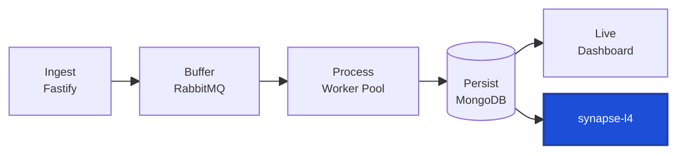
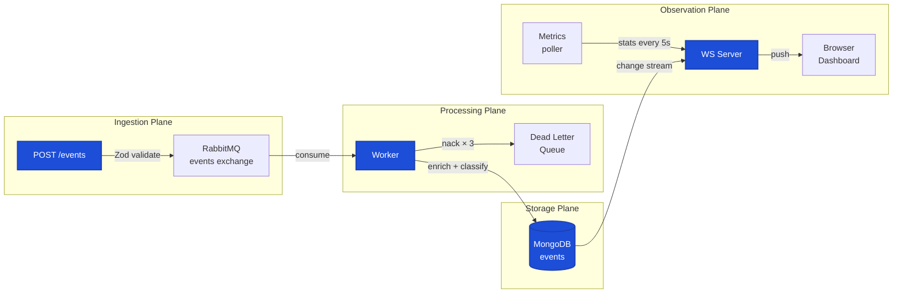

# EventHorizon

EventHorizon is a real-time **telemetry and data streaming pipeline**. It processes live event data—like sensor readings or system metrics—and pushes it to a live browser dashboard in under a second.

Architecturally, this project is a production-grade blueprint for a **Reactive Data Plane**. It demonstrates how to connect four decoupled processing stages (Ingestion → Buffering → Processing → Observation) using asynchronous message queues, change data capture, and end-to-end distributed tracing.

---


```mermaid
%%{init: {'themeVariables': {'fontSize': '10px'}, 'flowchart': {'nodeSpacing': 15, 'rankSpacing': 25}}}%%
flowchart LR
    A[Ingest<br/>Fastify] --> B[Buffer<br/>RabbitMQ]
    B --> C[Process<br/>Worker Pool]
    C --> D[(Persist<br/>MongoDB)]
    D --> E[Live<br/>Dashboard]
    D --> F[synapse-l4]

    click F "https://github.com/obrienma/synapse-l4" "Go to synapse-l4 repo"

    classDef clickable fill:#1d4ed8,stroke:#1e40af,stroke-width:2px,color:#ffffff
    class F clickable
```

---


## 📋 Contents

- [🧰 Stack](#-stack)
- [🏗️ Architecture Overview](#️-architecture-overview)
- [🔭 Observability](#-observability)
- [📚 Docs](#-docs)
- [🗂️ Project Structure](#️-project-structure)
- [🗺️ Roadmap](#️-roadmap)
- [🚀 Quick Start](#-quick-start)
- [📦 npm Scripts](#-npm-scripts)
- [🧠 TS Patterns Demonstrated](#-ts-patterns-demonstrated)

## 🧰 Stack

| Layer | Tech | Notes |
|---|---|---|
| Language | TypeScript (strict) | `NodeNext` module resolution |
| Framework | Fastify | High throughput, schema hooks |
| Message broker | RabbitMQ 3 | Topic exchange topology featuring an explicit 3x-nack Dead Letter Queue (DLQ) retry strategy |
| Database | MongoDB 7 | Append-only event log optimized for Change Streams to drive real-time downstream reactivity |
| Real-time | WebSockets (`@fastify/websocket`) | Lightweight native WebSocket layer avoiding the overhead of heavy abstractions |
| Validation | Zod | Shared boundary contract across all layers |
| Observability | OpenTelemetry (traces + metrics) | Wide spans on all four planes, custom pipeline metrics, OTLP export |
| Testing | Vitest + mongodb-memory-server | ESM-native, colocated tests |


## 🏗️ Architecture Overview


```mermaid
flowchart LR
    subgraph Ingestion Plane
        A[POST /events] -->|Zod validate| B[RabbitMQ<br/>events exchange]
    end

    subgraph Processing Plane
        B -->|consume| C[Worker]
        C -->|nack × 3| E[Dead Letter<br/>Queue]
    end

    subgraph Storage Plane
        D[(MongoDB<br/>events)]
    end

    subgraph Observation Plane
        F[WS Server]
        F -->|push| G[Browser<br/>Dashboard]
        H[Metrics<br/>poller] -->|stats every 5s| F
    end

    C -->|enrich + classify| D
    D -->|change stream| F

    click A "/src/ingestion/" "Go to Ingestion Source"
    click C "/src/processing/" "Go to Processing Source"
    click D "/src/storage/" "Go to Storage Source"
    click F "/src/observation/" "Go to Observation Source"

    classDef clickable fill:#1d4ed8,stroke:#1e40af,stroke-width:2px,color:#ffffff
    class A,C,D,F clickable
```

## 🔭 Observability

The **built-in dashboard** (`/dashboard`) is a WebSocket-fed live event feed — raw throughput and pipeline stats updated in real time. For deeper visibility, EventHorizon is also instrumented with OpenTelemetry and emits traces and metrics to a companion **[Grafana monitoring stack](https://github.com/obrienma/rhizome-observability)** — service health, distributed traces, and failure signals the HTTP response can't surface. (Log shipping to Loki is a planned next step; for now logs stay on the console.) In practice the Grafana layer means:

* **One trace per event, end to end.** A single event is followed across the whole pipeline, even across process boundaries — so when something is slow or breaks, you can see exactly where.
* **A live dashboard.** Service health and what the pipeline is doing, at a glance — and the underlying traces are one click away for drill-down. Screenshot below.
* **Failures the response can't show.** Events are processed after the request comes back, so a request can succeed and still fail later — those failures are tracked too, never hidden.
* **Fault injection for demos.** Optional flags inject real errors so the dashboard's error panels have realistic traffic to show — off by default.

<p><em><span style="color: #f59e0b">Errors shown are synthetic — generated via opt-in fault injection for dashboard demo traffic.</span></em></p>


## 📚 Docs

Each doc carries a **Last updated** date (last content edit) and a **Verified** date (last time its claims were checked against the code). Bump both when you touch a doc; bump Verified alone after an audit.

| File | Contents | Last updated | Verified |
| --- | --- | --- | --- |
| [README.md](README.md) | Project overview | 2026-06-17 | 2026-06-17 |
| [ARCHITECTURE.md](docs/ARCHITECTURE.md) | Layer design, data flow, RabbitMQ topology | 2026-06-17 | 2026-06-17 |
| [SERVICES.md](docs/SERVICES.md) | Per-module reference | 2026-06-14 | 2026-06-14 |
| [API.md](docs/API.md) | HTTP + WebSocket routes | 2026-06-14 | 2026-06-14 |
| [DEV_GETTING_STARTED.md](docs/DEV_GETTING_STARTED.md) | Full local setup walkthrough | 2026-06-14 | 2026-06-14 |
| [TESTING.md](docs/TESTING.md) | Test strategy, what's covered and what isn't | 2026-06-14 | 2026-06-14 |
| [USER_STORIES.md](docs/USER_STORIES.md) | What each persona needs, mapped to the code that delivers it | 2026-06-15 | 2026-06-14 |
| [diagrams/OVERVIEW.md](docs/diagrams/OVERVIEW.md) | Architecture diagrams | 2026-06-14 | 2026-06-14 |
| [adr/](docs/adr/) | Architecture Decision Records | 2026-06-17 | — |
| [journal.md](docs/journal.md) | Engineering journal — one entry per phase | 2026-06-15 | — |

## 🗂️ Project Structure

```
src/
  config.ts                     # Env vars parsed/validated via Zod
  server.ts                     # Fastify entry + graceful shutdown

  ingestion/                    # ── Ingestion Plane ──
    event.schema.ts             # Zod discriminated union + inferred types
    event.routes.ts             # POST /events, GET /events, GET /events/:id

  processing/                   # ── Processing Plane ──
    queue.ts                    # RabbitMQ connection, exchange/queue setup
    worker.ts                   # Consumer: ack/nack, retry, DLQ
    processors/
      enrich.ts                 # Add receivedAt, enrichedAt, source metadata
      classify.ts               # Classify: normal | warning | critical

  storage/                      # ── Storage Plane ──
    db.ts                       # MongoDB client + connection
    event.repository.ts         # Append-only repo, idempotent insert

  observation/                  # ── Observation Plane ──
    changeStream.ts             # Change stream with resume token + backoff
    checkpoint.ts               # Persists resume token to MongoDB (pod-restart safe)
    wsServer.ts                 # WebSocket connection manager + broadcast
    metrics.ts                  # Rolling stats, lag, type distribution
    tracing.ts                  # OpenTelemetry SDK bootstrap + wide-span helpers

  health.routes.ts              # GET /healthz — MongoDB ping for k3s probes

  dashboard/
    index.html                  # Single-file live dashboard (vanilla JS)

  seed/
    producer.ts                 # CLI fake event generator

k3s/
  namespace.yaml
  configmap.yaml
  secret.yaml                   # Template — replace values before applying
  server.yaml                   # Deployment + NodePort Service
  worker.yaml                   # Deployment (replicas: 2, CMD override)

```

> **Architecture Scale Note:** Because the storage layer implements an idempotent repository layout, the `processing/` plane can safely scale horizontally (e.g., `replicas: 2` in k3s manifests via Competing Consumers pattern) with zero data corruption or duplication risk.

## 🗺️ Roadmap

### ✅ Phase 1 — Foundation

* [x] Project scaffold, tsconfig, docker-compose
* [x] Documentation + AI context files (CLAUDE.md, copilot-instructions.md)
* [x] `src/config.ts` — env validation via Zod
* [x] `src/ingestion/event.schema.ts` — discriminated union types

### ✅ Phase 2 — Entry Point + Ingestion (current)

* [x] `src/server.ts` — Fastify app, signal handling, graceful shutdown skeleton
* [x] `src/ingestion/event.routes.ts` — POST /events, Zod validation, 202 Accepted
* [x] `src/processing/queue.ts` (stub) — `publishEvent` placeholder

### ✅ Phase 3 — Message Broker

* [x] `src/processing/queue.ts` — RabbitMQ topology + real `publishEvent()`
* [x] `src/processing/worker.ts` + `processors/enrich.ts` + `processors/classify.ts`

### ✅ Phase 4 — Storage Plane

* [x] `src/storage/db.ts` — MongoDB client connection
* [x] `src/storage/event.repository.ts` — idempotent inserts, duplicate key handling

### ✅ Phase 5 — Observation Plane

* [x] `src/observation/changeStream.ts` — MongoDB change stream, callback-based push
* [x] `src/observation/wsServer.ts` — WebSocket connection manager + broadcast
* [x] `src/observation/metrics.ts` — rolling stats, lag, type distribution

### ✅ Phase 6 — Dashboard + Seed

* [x] `src/seed/producer.ts` — CLI fake event generator
* [x] `src/dashboard/index.html` — live feed, stats bar, event detail (vanilla JS)

### ✅ Phase 7–9 — Tests

* [x] Processor unit tests (`enrich`, `classify`)
* [x] Repository tests with `mongodb-memory-server`
* [x] Route tests with Fastify `inject()` + `vi.mock`
* [x] Metrics tests with `vi.useFakeTimers`
* [x] Worker handler tests (ack/nack/retry/DLQ paths)

### ✅ Phase 10 — Bug Fix: Flow Control

* [x] `ch.publish()` return value handled — no silent message drop under backpressure
* [x] `messageId` threaded through retry republish

### ✅ Phase 11 — Durable Resume Token

* [x] `src/observation/checkpoint.ts` — persists change stream token to MongoDB
* [x] Pod restarts replay missed events; oplog overrun (error 286) detected and cleared

### ✅ Phase 12 — Dockerfile

* [x] Multi-stage build: compiler stage + lean production runtime (~181 MB)
* [x] Non-root user; test files excluded from `dist/` via `tsconfig.build.json`

### ✅ Phase 13 — Health Check

* [x] `GET /healthz` — pings MongoDB; 200 ok / 503 degraded
* [x] Wired to k3s liveness and readiness probes

### ✅ Phase 14 — k3s Manifests

* [x] Namespace, ConfigMap, Secret template, server Deployment+Service, worker Deployment
* [x] Worker runs `replicas: 2` (Competing Consumers — safe with idempotent inserts)

### ✅ Phase 15 — Distributed Tracing (OpenTelemetry)

* [x] `src/observation/tracing.ts` — OTel SDK bootstrap, OTLP/HTTP exporter
* [x] Wide spans on all four planes — `event.process` (worker), `event.observe` (server)
* [x] W3C trace context propagated across the RabbitMQ boundary; parse-failure span events

### ✅ Phase 16–18 — Observability Hardening

* [x] Live-validated the full pipeline against a Grafana stack (Tempo + Prometheus)
* [x] Opt-in fault injection for demo traffic — off by default
* [x] Custom OTel metrics for pipeline-internal signals — per-type processed/failed counters and change-stream lag

## 🚀 Quick Start

```bash
# 1. Start infrastructure
npm run infra
# MongoDB on :27017 | RabbitMQ on :5672 | Management UI on :15672 (guest/guest)

# 2. Copy env
cp .env.example .env

# 3. Install deps
npm install

# 4. Start server
npm run dev

# 5. In a separate terminal, start the worker (consumes + processes events)
npm run worker

# 6. In a third terminal, generate fake events
npm run seed -- --rate=2 --type=all

# 7. Open dashboard
open http://localhost:3000/dashboard

```

> Distributed tracing is optional — point `OTEL_EXPORTER_OTLP_ENDPOINT` at a running
> OTel Collector to see traces. The SDK no-ops silently if no collector is reachable.

## 📦 npm Scripts

| Script | Description |
| --- | --- |
| `npm run dev` | Start Fastify server with tsx |
| `npm run worker` | Start RabbitMQ consumer worker |
| `npm run seed` | Run fake event generator CLI |
| `npm run infra` | `docker compose up -d` |
| `npm run infra:down` | `docker compose down` |
| `npm test` | Run Vitest suite |
| `npm run test:watch` | Vitest in watch mode |
| `npm run build` | Compile to `dist/` (production, no test files) |
| `npm run typecheck` | `tsc --noEmit` |

## 🧠 TS Patterns Demonstrated

* Discriminated unions for event types (`pipeline` | `sensor` | `app`)
* `z.infer<typeof Schema>` — no type duplication across layers
* Generic repository pattern over MongoDB collections
* Typed async iterators (MongoDB change streams as `AsyncIterable`)
* Typed AMQP message payloads across publish/consume boundary
* Strict null safety across async flows

