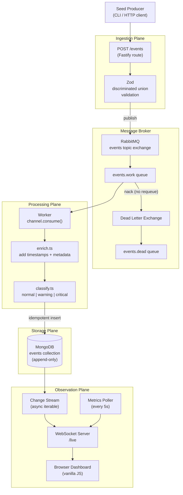
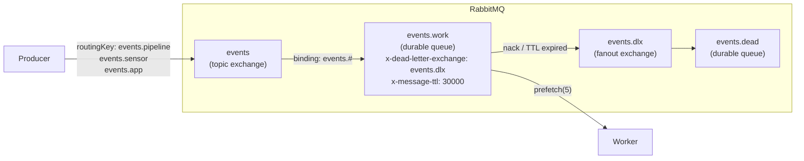
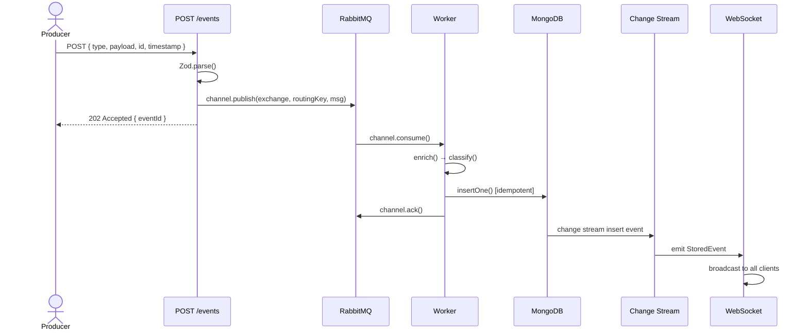
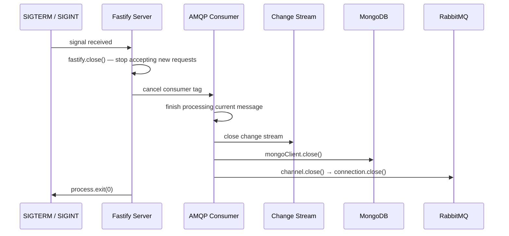

# Architecture

EventHorizon is structured as four explicit **planes**, each with a single responsibility. The planes are one-directional: data flows inward through ingestion, down through processing and storage, and out through observation. Nothing flows backwards.

## System Diagram

## The Four Planes

### Ingestion Plane (`src/ingestion/`)

The only entry point for events. Validates incoming JSON against a Zod discriminated union and immediately publishes to the RabbitMQ exchange. The HTTP response returns as soon as the message is confirmed published — processing is fully decoupled.

**Contracts:** `AppEvent` (Zod-inferred type) is the shared type that flows through every subsequent layer.

### Processing Plane (`src/processing/`)

A long-running AMQP consumer. Picked up messages are enriched (timestamps, source metadata) and classified (severity). On success: `channel.ack()` + store. On failure: `channel.nack(msg, false, false)` — the message is refused without requeue, triggering the Dead Letter Exchange.

**Backpressure:** `channel.prefetch(N)` limits how many unacknowledged messages the worker holds at once. When the worker is saturated, RabbitMQ stops delivering. Messages queue up visibly in the Management UI.

### Storage Plane (`src/storage/`)

Append-only. Events are never updated. A unique index on `raw.id` (the UUID from the producer) makes inserts **idempotent** — if a worker retries the same message, the second insert silently fails duplicate-key, not the whole job.

**Schema:** `StoredEvent` = `{ raw: AppEvent, processed: { enrichedAt, classification, tags }, status }`.

### Observation Plane (`src/observation/`)

Three components:

1. **`changeStream.ts`** — opens a MongoDB change stream on the `events` collection, filtered to `insert` operations. Wraps the stream as an `AsyncIterable<ChangeStreamInsertDocument>`. Handles stream close and reconnection.

2. **`wsServer.ts`** — manages connected WebSocket clients. Iterates the change stream and broadcasts each new `StoredEvent` as a `{ type: "event", data }` message. Handles client connect/disconnect without leaking listeners.

3. **`metrics.ts`** — polls RabbitMQ Management API and MongoDB every 5s, computes rolling processing rate from an in-memory ring buffer, and broadcasts `{ type: "stats", data }` to all connected clients.

---

## RabbitMQ Topology

**Key decisions:**
- Topic exchange with `events.#` binding — makes adding new event types zero-config (no new bindings needed)
- `x-message-ttl` on the work queue — messages that sit unprocessed for 30s are dead-lettered automatically, preventing indefinite build-up during worker outages
- Worker retries are handled at the application level (up to 3 attempts tracked in the message header `x-retry-count`) before the final `nack`

---

## Data Flow: Sequence

---

## Graceful Shutdown Sequence

Order matters: the consumer is cancelled before closing the channel to avoid message loss. MongoDB is closed after the change stream (which depends on the connection).
