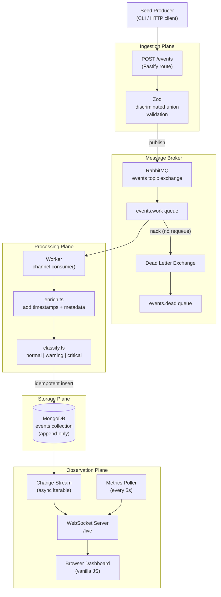
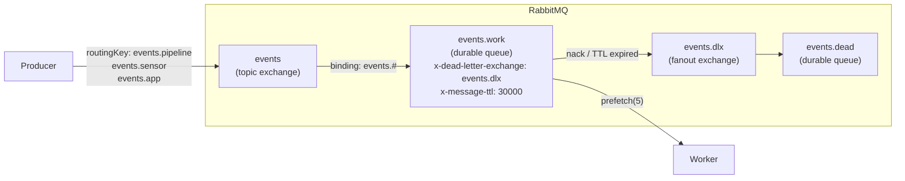
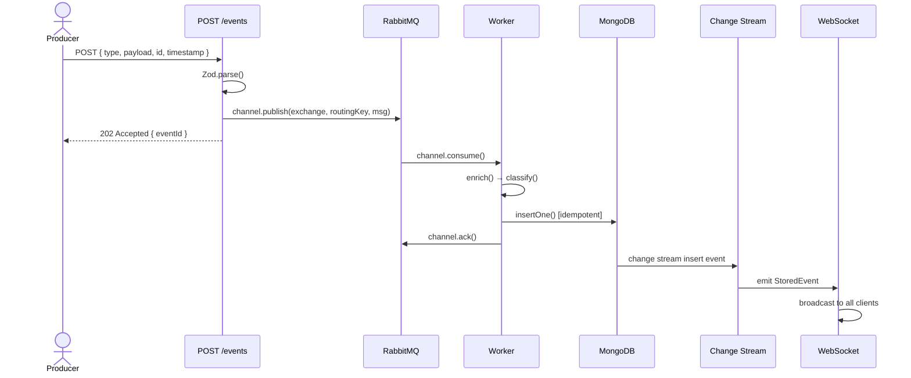
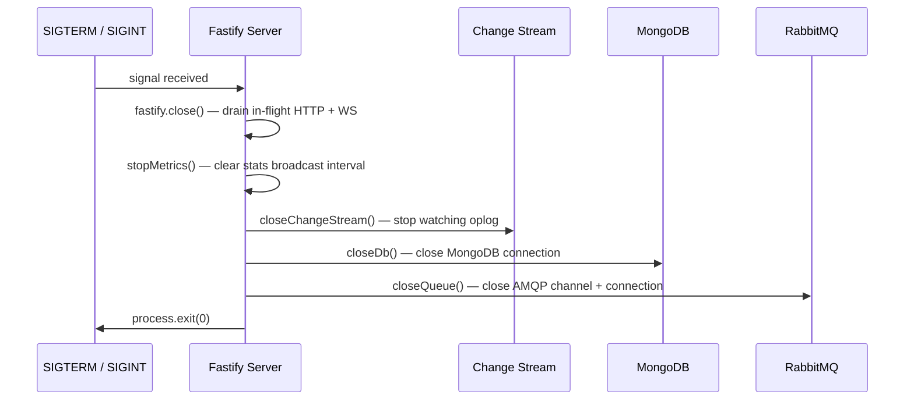
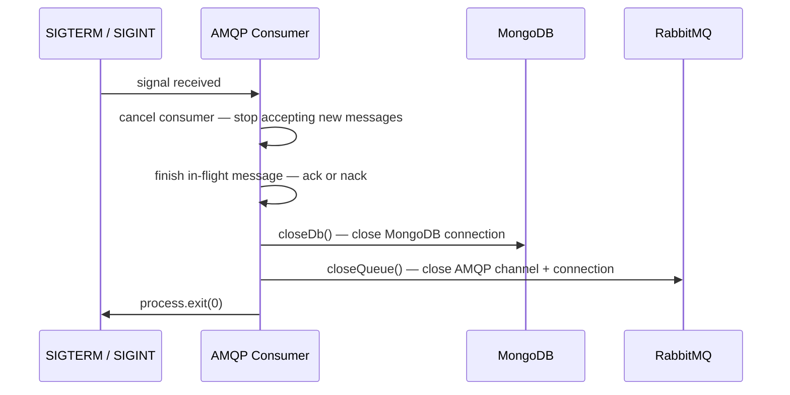

# Architecture

EventHorizon is structured as four explicit **planes**, each with a single responsibility. The planes are one-directional: data flows inward through ingestion, down through processing and storage, and out through observation. Nothing flows backwards.

## System Diagram

```mermaid
flowchart TD
    Producer["Seed Producer<br/>(CLI / HTTP client)"]

    subgraph IP ["Ingestion Plane"]
        Route["POST /events<br/>(Fastify route)"]
        Zod["Zod<br/>discriminated union<br/>validation"]
        Route --> Zod
    end

    subgraph MQ ["Message Broker"]
        Exchange["RabbitMQ<br/>events topic exchange"]
        WorkQ["events.work queue"]
        DLX["Dead Letter Exchange"]
        DLXQ["events.dead queue"]
        Exchange --> WorkQ
        WorkQ -->|"nack (no requeue)"| DLX
        DLX --> DLXQ
    end

    subgraph PP ["Processing Plane"]
        Worker["Worker<br/>channel.consume()"]
        Enrich["enrich.ts<br/>add timestamps + metadata"]
        Classify["classify.ts<br/>normal | warning | critical"]
        Worker --> Enrich --> Classify
    end

    subgraph SP ["Storage Plane"]
        Mongo[("MongoDB<br/>events collection<br/>(append-only)")]
    end

    subgraph OP ["Observation Plane"]
        CS["Change Stream<br/>(async iterable)"]
        WS["WebSocket Server<br/>/live"]
        Metrics["Metrics Poller<br/>(every 5s)"]
        Dashboard["Browser Dashboard<br/>(vanilla JS)"]
        CS --> WS
        Metrics --> WS
        WS --> Dashboard
    end

    Producer --> Route
    Zod -->|"publish"| Exchange
    WorkQ --> Worker
    Classify -->|"idempotent insert"| Mongo
    Mongo --> CS
```

## The Four Planes

### Ingestion Plane (`src/ingestion/`)

The only entry point for events. Validates incoming JSON against a Zod discriminated union and immediately publishes to the RabbitMQ exchange. The HTTP response returns as soon as the message is confirmed published — processing is fully decoupled.

**Contracts:** `AppEvent` (Zod-inferred type) is the shared type that flows through every subsequent layer.

### Processing Plane (`src/processing/`)

A long-running AMQP consumer. Picked up messages are enriched (timestamps, source metadata) and classified (severity). On success: `channel.ack()` + store. On failure: `channel.nack(msg, false, false)` — the message is refused without requeue, triggering the Dead Letter Exchange.

**Backpressure:** `channel.prefetch(N)` limits how many unacknowledged messages the worker holds at once. When the worker is saturated, RabbitMQ stops delivering. Messages queue up visibly in the Management UI.

### Storage Plane (`src/storage/`)

Append-only. Events are never updated. A unique index on `raw.id` (the UUID from the producer) makes inserts **idempotent** — if a worker retries the same message, the second insert silently fails duplicate-key, not the whole job.

**Schema:** `StoredEvent` = `{ raw: AppEvent, processed: { enrichedAt, classification, tags }, status }`.

### Observation Plane (`src/observation/`)

EventHorizon has two independent observability surfaces — the **built-in dashboard** and an **external Grafana stack**. They serve different purposes and have no dependency on each other.

#### Built-in dashboard (`/dashboard`)

Four components power the native live feed:

1. **`changeStream.ts`** — opens a MongoDB change stream on the `events` collection, filtered to `insert` operations. Accepts an `onInsert` callback and calls it for each new document. Returns a teardown function used during graceful shutdown. Recovers from cursor errors by reopening with `{ resumeAfter: lastToken }` after exponential backoff; the token is persisted via `checkpoint.ts` so **pod restarts replay missed events** rather than re-anchoring at the current oplog head (oplog overrun, error 286, clears the stale checkpoint). See ADR 0013.

2. **`wsServer.ts`** — manages connected WebSocket clients. Iterates the change stream and broadcasts each new `StoredEvent` as a `{ type: "event", data }` message. Handles client connect/disconnect without leaking listeners.

3. **`metrics.ts`** — polls RabbitMQ Management API and MongoDB every 5s, computes rolling processing rate from an in-memory ring buffer, and broadcasts `{ type: "stats", data }` to all connected clients.

4. **`checkpoint.ts`** — persists the change stream resume token to MongoDB (`changestream_checkpoints` collection) on every delivered event, so pod restarts replay from the last known position rather than the current oplog head.

#### External Grafana stack ([rhizome-observability](https://github.com/obrienma/rhizome-observability))

EventHorizon emits signals to a companion Grafana stack via OpenTelemetry and RabbitMQ's built-in Prometheus exporter. See the [Tracing & Instrumentation](#tracing--instrumentation) section below for the full signal inventory.

---

## RabbitMQ Topology

```mermaid
flowchart LR
    P[Producer] -->|"routingKey: events.pipeline<br/>events.sensor<br/>events.app"| EX

    subgraph RabbitMQ
        EX["events<br/>(topic exchange)"]
        WQ["events.work<br/>(durable queue)<br/>x-dead-letter-exchange: events.dlx<br/>x-message-ttl: 30000"]
        DLX_EX["events.dlx<br/>(fanout exchange)"]
        DLQ["events.dead<br/>(durable queue)"]

        EX -->|"binding: events.#"| WQ
        WQ -->|"nack / TTL expired"| DLX_EX
        DLX_EX --> DLQ
    end

    WQ -->|"prefetch(5)"| Worker
```

**Key decisions:**
- Topic exchange with `events.#` binding — makes adding new event types zero-config (no new bindings needed)
- `x-message-ttl` on the work queue — messages that sit unprocessed for 30s are dead-lettered automatically, preventing indefinite build-up during worker outages
- Worker retries are handled at the application level (up to 3 attempts tracked in the message header `x-retry-count`) before the final `nack`

---

## Tracing & Instrumentation

EventHorizon emits three categories of signal to the external Grafana stack.

### Distributed traces (OTel)

The SDK is bootstrapped in `src/observation/tracing.ts` and exports spans over OTLP/HTTP (`OTEL_EXPORTER_OTLP_ENDPOINT`, default `http://localhost:4318`). If no collector is reachable the SDK no-ops silently. SDK bootstrap ordering is covered by ADR 0015.

The design favours **wide spans** over pre-aggregated counters for analytical queries — see ADR 0016. Two first-class spans bracket the pipeline:

- **`event.process`** (`SpanKind.CONSUMER`, worker) — carries `event.id`, `event.type`, `classification`, `classification.tags`, `retry.count`, `write.collection`, and `messaging.*` attributes. A message that fails `EventSchema.parse()` records a `message.parse_failed` span event and sets the span status to `ERROR`.
- **`event.observe`** (`SpanKind.INTERNAL`, server) — carries `subscribers.count`, `fanout.duration_ms`, and `changeStream.lag_ms` for the change-stream → WebSocket fanout.

**Trace continuity across the RabbitMQ boundary:** `queue.ts` injects the active W3C trace context into AMQP message headers (`propagation.inject`); `worker.ts` extracts it (`propagation.extract`) so the consumer span continues the same trace started at HTTP ingest. The result is a single connected waterfall — HTTP ingest → AMQP publish → `event.process` → MongoDB insert → `event.observe` — rather than two disconnected root traces.

### Custom OTel metrics (Phase 18)

Two counters and one gauge are exported via the env-configured `MeterProvider` (no additional wiring beyond the existing OTel bootstrap):

| Prometheus metric | Instrument | Labels | Source | Description |
|---|---|---|---|---|
| `events_processed_total` | Counter | `event_type` | `worker.ts` | Incremented on every successful `channel.ack()` |
| `events_failed_total` | Counter | `event_type`, `failure_reason` | `worker.ts` | Incremented on retry exhaustion; `failure_reason` ∈ `{parse_error, schema_error, processing_error}` |
| `eventhorizon_change_stream_lag_milliseconds` | ObservableGauge | — | `metrics.ts` | Time between MongoDB insert and change stream delivery |

These cover failure signals the HTTP response code cannot surface — a 202 response may still result in a dead-lettered event.  See ADR 0017.

### RabbitMQ Prometheus exporter

RabbitMQ's built-in exporter (`rabbitmq_prometheus` plugin, enabled by default) is published on port `:15692`. A Prometheus scrape job in rhizome-observability targets this port to provide queue depth, message rates, and consumer counts without any EventHorizon code.

### Fault injection (Phase 17)

Two opt-in knobs inject real errors for dashboard demo traffic — both default to `0` (off):

- **`CHAOS_ERROR_RATE`** (server env var, `0`–`1`) — throws after Zod validation to produce real HTTP 500s.
- **`--error-rate`** (seed producer CLI flag, `0`–`1`) — sends a malformed `id` to trigger real 422s.

See ADR 0016 for the alerting-vs-analysis decision that determines which signals get counters vs span attributes.

---

## Data Flow: Sequence

```mermaid
sequenceDiagram
    actor Producer
    participant Route as POST /events
    participant RMQ as RabbitMQ
    participant Worker
    participant Mongo as MongoDB
    participant CS as Change Stream
    participant WS as WebSocket

    Producer->>Route: POST { type, payload, id, timestamp }
    Route->>Route: Zod.parse()
    Route->>RMQ: channel.publish(exchange, routingKey, msg)
    Route-->>Producer: 202 Accepted { eventId }

    RMQ->>Worker: channel.consume()
    Worker->>Worker: enrich() → classify()
    Worker->>Mongo: insertOne() [idempotent]
    Worker->>RMQ: channel.ack()

    Mongo->>CS: change stream insert event
    CS->>WS: emit StoredEvent
    WS->>WS: broadcast to all clients
```

---

## Graceful Shutdown Sequence

The server and worker are separate processes with independent shutdown handlers.

### Server (`npm run dev`)

```mermaid
sequenceDiagram
    participant OS as SIGTERM / SIGINT
    participant Server as Fastify Server
    participant CS as Change Stream
    participant Mongo as MongoDB
    participant RMQ as RabbitMQ

    OS->>Server: signal received
    Server->>Server: fastify.close() — drain in-flight HTTP + WS
    Server->>Server: stopMetrics() — clear stats broadcast interval
    Server->>CS: closeChangeStream() — stop watching oplog
    Server->>Mongo: closeDb() — close MongoDB connection
    Server->>RMQ: closeQueue() — close AMQP channel + connection
    Server->>OS: process.exit(0)
```

MongoDB is closed after the change stream because the change stream cursor depends on the connection.

### Worker (`npm run worker`)

```mermaid
sequenceDiagram
    participant OS as SIGTERM / SIGINT
    participant Worker as AMQP Consumer
    participant Mongo as MongoDB
    participant RMQ as RabbitMQ

    OS->>Worker: signal received
    Worker->>Worker: cancel consumer — stop accepting new messages
    Worker->>Worker: finish in-flight message — ack or nack
    Worker->>Mongo: closeDb() — close MongoDB connection
    Worker->>RMQ: closeQueue() — close AMQP channel + connection
    Worker->>OS: process.exit(0)
```

Consumer cancellation happens before channel close to avoid message loss — a channel closed mid-delivery leaves the message unacked and it will be redelivered to another worker.
