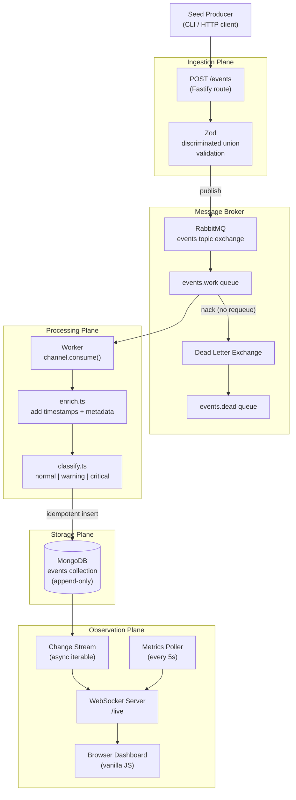
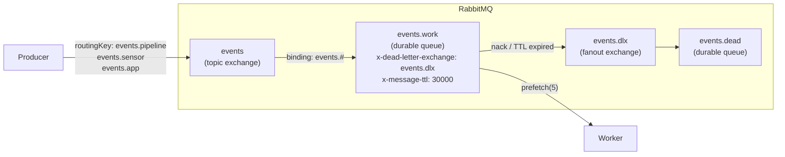
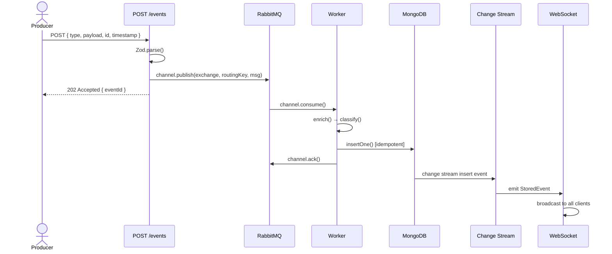
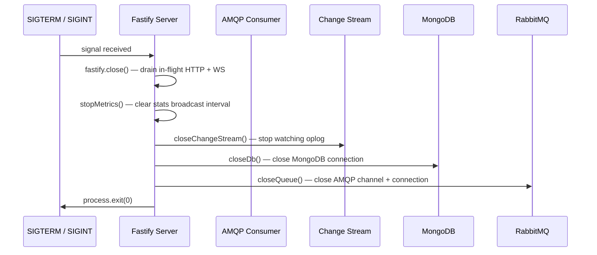

# Architecture

_Last updated: 2026-06-14 · Verified against `src/`: 2026-06-14_

EventHorizon is structured as four explicit **planes**, each with a single responsibility. The planes are one-directional: data flows inward through ingestion, down through processing and storage, and out through observation. Nothing flows backwards.

## System Diagram

```mermaid
flowchart TD
    Producer["Seed Producer\n(CLI / HTTP client)"]

    subgraph IP ["Ingestion Plane"]
        Route["POST /events\n(Fastify route)"]
        Zod["Zod\ndiscriminated union\nvalidation"]
        Route --> Zod
    end

    subgraph MQ ["Message Broker"]
        Exchange["RabbitMQ\nevents topic exchange"]
        WorkQ["events.work queue"]
        DLX["Dead Letter Exchange"]
        DLXQ["events.dead queue"]
        Exchange --> WorkQ
        WorkQ -->|"nack (no requeue)"| DLX
        DLX --> DLXQ
    end

    subgraph PP ["Processing Plane"]
        Worker["Worker\nchannel.consume()"]
        Enrich["enrich.ts\nadd timestamps + metadata"]
        Classify["classify.ts\nnormal | warning | critical"]
        Worker --> Enrich --> Classify
    end

    subgraph SP ["Storage Plane"]
        Mongo[("MongoDB\nevents collection\n(append-only)")]
    end

    subgraph OP ["Observation Plane"]
        CS["Change Stream\n(async iterable)"]
        WS["WebSocket Server\n/live"]
        Metrics["Metrics Poller\n(every 5s)"]
        Dashboard["Browser Dashboard\n(vanilla JS)"]
        CS --> WS
        Metrics --> WS
        WS --> Dashboard
    end

    Producer --> Route
    Zod -->|"publish"| Exchange
    WorkQ --> Worker
    Classify -->|"idempotent insert"| Mongo
    Mongo --> CS
```

## The Four Planes

### Ingestion Plane (`src/ingestion/`)

The only entry point for events. Validates incoming JSON against a Zod discriminated union and immediately publishes to the RabbitMQ exchange. The HTTP response returns as soon as the message is confirmed published — processing is fully decoupled.

**Contracts:** `AppEvent` (Zod-inferred type) is the shared type that flows through every subsequent layer.

### Processing Plane (`src/processing/`)

A long-running AMQP consumer. Picked up messages are enriched (timestamps, source metadata) and classified (severity). On success: `channel.ack()` + store. On failure: `channel.nack(msg, false, false)` — the message is refused without requeue, triggering the Dead Letter Exchange.

**Backpressure:** `channel.prefetch(N)` limits how many unacknowledged messages the worker holds at once. When the worker is saturated, RabbitMQ stops delivering. Messages queue up visibly in the Management UI.

### Storage Plane (`src/storage/`)

Append-only. Events are never updated. A unique index on `raw.id` (the UUID from the producer) makes inserts **idempotent** — if a worker retries the same message, the second insert silently fails duplicate-key, not the whole job.

**Schema:** `StoredEvent` = `{ raw: AppEvent, processed: { enrichedAt, classification, tags }, status }`.

### Observation Plane (`src/observation/`)

Three components:

1. **`changeStream.ts`** — opens a MongoDB change stream on the `events` collection, filtered to `insert` operations. Accepts an `onInsert` callback and calls it for each new document. Returns a teardown function used during graceful shutdown. Recovers from cursor errors by reopening with `{ resumeAfter: lastToken }` after exponential backoff; the token is persisted via `checkpoint.ts` so **pod restarts replay missed events** rather than re-anchoring at the current oplog head (oplog overrun, error 286, clears the stale checkpoint). See ADR 0013.

2. **`wsServer.ts`** — manages connected WebSocket clients. Iterates the change stream and broadcasts each new `StoredEvent` as a `{ type: "event", data }` message. Handles client connect/disconnect without leaking listeners.

3. **`metrics.ts`** — polls RabbitMQ Management API and MongoDB every 5s, computes rolling processing rate from an in-memory ring buffer, and broadcasts `{ type: "stats", data }` to all connected clients.

---

## RabbitMQ Topology

```mermaid
flowchart LR
    P[Producer] -->|"routingKey: events.pipeline\nevents.sensor\nevents.app"| EX

    subgraph RabbitMQ
        EX["events\n(topic exchange)"]
        WQ["events.work\n(durable queue)\nx-dead-letter-exchange: events.dlx\nx-message-ttl: 30000"]
        DLX_EX["events.dlx\n(fanout exchange)"]
        DLQ["events.dead\n(durable queue)"]

        EX -->|"binding: events.#"| WQ
        WQ -->|"nack / TTL expired"| DLX_EX
        DLX_EX --> DLQ
    end

    WQ -->|"prefetch(5)"| Worker
```

**Key decisions:**
- Topic exchange with `events.#` binding — makes adding new event types zero-config (no new bindings needed)
- `x-message-ttl` on the work queue — messages that sit unprocessed for 30s are dead-lettered automatically, preventing indefinite build-up during worker outages
- Worker retries are handled at the application level (up to 3 attempts tracked in the message header `x-retry-count`) before the final `nack`

---

## Tracing & Instrumentation

EventHorizon emits **OpenTelemetry** traces from both process entry points (`npm run dev` and `npm run worker`). The SDK is bootstrapped in `src/observation/tracing.ts` and exports spans over OTLP/HTTP (`OTEL_EXPORTER_OTLP_ENDPOINT`, default `http://localhost:4318`). If no collector is reachable the SDK no-ops silently — there is no hard dependency on a tracing backend.

The design favours **wide spans** (many attributes per span, queried after the fact) over pre-aggregated counters — see ADR 0016. Two first-class spans bracket the pipeline:

- **`event.process`** (`SpanKind.CONSUMER`, worker) — carries `event.id`, `event.type`, `classification`, `classification.tags`, `retry.count`, `write.collection`, and `messaging.*` attributes. A message that fails `EventSchema.parse()` records a `message.parse_failed` span event and sets the span status to `ERROR`.
- **`event.observe`** (`SpanKind.INTERNAL`, server) — carries `subscribers.count`, `fanout.duration_ms`, and `changeStream.lag_ms` for the change-stream → WebSocket fanout.

**Trace continuity across the RabbitMQ boundary** is the key property: `queue.ts` injects the active W3C trace context into the AMQP message headers (`propagation.inject`), and `worker.ts` extracts it (`propagation.extract`) so the consumer span continues the same trace started at HTTP ingest. The result is a single connected waterfall — HTTP ingest → AMQP publish → `event.process` → MongoDB insert → `event.observe` — rather than two disconnected root traces. SDK bootstrap ordering is covered by ADR 0015; the alerting-vs-analysis split between counters and span attributes by ADR 0016.

---

## Data Flow: Sequence

```mermaid
sequenceDiagram
    actor Producer
    participant Route as POST /events
    participant RMQ as RabbitMQ
    participant Worker
    participant Mongo as MongoDB
    participant CS as Change Stream
    participant WS as WebSocket

    Producer->>Route: POST { type, payload, id, timestamp }
    Route->>Route: Zod.parse()
    Route->>RMQ: channel.publish(exchange, routingKey, msg)
    Route-->>Producer: 202 Accepted { eventId }

    RMQ->>Worker: channel.consume()
    Worker->>Worker: enrich() → classify()
    Worker->>Mongo: insertOne() [idempotent]
    Worker->>RMQ: channel.ack()

    Mongo->>CS: change stream insert event
    CS->>WS: emit StoredEvent
    WS->>WS: broadcast to all clients
```

---

## Graceful Shutdown Sequence

```mermaid
sequenceDiagram
    participant OS as SIGTERM / SIGINT
    participant Server as Fastify Server
    participant Worker as AMQP Consumer
    participant CS as Change Stream
    participant Mongo as MongoDB
    participant RMQ as RabbitMQ

    OS->>Server: signal received
    Server->>Server: fastify.close() — drain in-flight HTTP + WS
    Server->>Server: stopMetrics() — clear stats broadcast interval
    Server->>CS: closeChangeStream() — stop watching oplog
    Server->>Mongo: closeDb() — close MongoDB connection
    Server->>RMQ: closeQueue() — close AMQP channel + connection
    Server->>OS: process.exit(0)
```

Order matters: the consumer is cancelled before closing the channel to avoid message loss. MongoDB is closed after the change stream (which depends on the connection).
