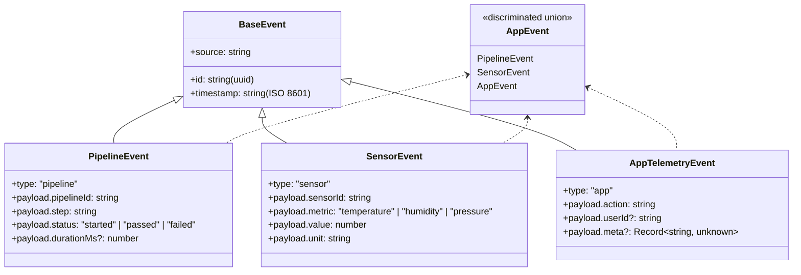

# Services Reference

Per-module breakdown of every file in `src/`. Each entry covers: purpose, key exports, external dependencies, and what to look for when debugging.

---

## `src/config.ts`

Parses and validates all environment variables using Zod at startup. If any required var is missing or malformed, the process exits with a clear error before any connections are attempted.

**Exports:** `config` — a fully-typed, readonly config object.

**Pattern:** `z.infer<typeof ConfigSchema>` — the config type is derived from the schema, not written by hand.

---

## `src/server.ts`

Fastify application entry point. Registers plugins (`@fastify/websocket`), mounts routes, and orchestrates graceful shutdown on `SIGTERM`/`SIGINT`.

**The shutdown sequence is defined here** — see [ARCHITECTURE.md](ARCHITECTURE.md#graceful-shutdown-sequence).

---

## Ingestion Plane

### `src/ingestion/event.schema.ts`

The **shared contract** for the entire system. All other modules import their event types from here — nothing defines its own event shape.



**Key exports:** `EventSchema`, `AppEvent`, `StoredEventSchema`, `StoredEvent`

### `src/ingestion/event.routes.ts`

Registers three routes on the Fastify instance:

| Route | Handler |
|---|---|
| `POST /events` | Validate → store as `queued` → publish to RabbitMQ → `202` |
| `GET /events` | Paginated query with `?page`, `?limit`, `?type`, `?status` filters |
| `GET /events/:id` | Single event by MongoDB `_id` |
| `GET /health` | Liveness check |

---

## Processing Plane

### `src/processing/queue.ts`

Manages the AMQP connection and channel lifecycle. Declares the topic exchange, work queue (with DLX arguments), dead-letter exchange, and dead-letter queue. Exports a `publishEvent()` function used by the ingestion route.

**Topology declared here** (idempotent — safe to call on every startup).

### `src/processing/worker.ts`

Long-running AMQP consumer. Sets `channel.prefetch(N)` for backpressure, then calls `channel.consume()`. Per message:

1. Parse and validate the payload
2. Call `enrich()` then `classify()`
3. Attempt `repository.insertOne()` (idempotent)
4. On success: `channel.ack(msg)`
5. On error: check `x-retry-count` header. If `< 3`, republish with incremented count. If `>= 3`, `channel.nack(msg, false, false)` → dead-letter.

### `src/processing/processors/enrich.ts`

Pure function. Takes a validated `AppEvent`, returns an enriched object with `receivedAt`, `enrichedAt`, and any source-derived metadata. No side effects — easy to unit test.

### `src/processing/processors/classify.ts`

Pure function. Inspects the event type and payload to assign a severity: `"normal"` | `"warning"` | `"critical"`. Classification rules:

| Event type | Rule | Classification |
|---|---|---|
| `pipeline` | `status === "failed"` | `critical` |
| `pipeline` | `durationMs > 30000` | `warning` |
| `sensor` | Value outside expected range per metric | `warning` or `critical` |
| `app` | Any event | `normal` (extensible) |

---

## Storage Plane

### `src/storage/db.ts`

Singleton MongoDB client. Exposes `getDb()` which returns the connected `Db` instance. Connection is established once at startup and reused.

### `src/storage/event.repository.ts`

Generic typed repository over a MongoDB collection. Key method: `insertOne()` uses `{ ignoreUndefined: true }` and catches duplicate key errors (`code 11000`) silently — this is the idempotency guarantee.

**Unique index:** `{ "raw.id": 1, unique: true }` — created on first startup via `createIndexes()`.

---

## Observation Plane

### `src/observation/changeStream.ts`

Opens a MongoDB change stream on the `events` collection, filtered to `{ operationType: "insert" }`. Returns an `AsyncGenerator<StoredEvent>` — callers use `for await...of` without knowing it's a change stream.

Handles: stream errors, stream close (reconnects with backoff), and cancellation via `AbortSignal`.

### `src/observation/wsServer.ts`

Manages the set of connected WebSocket clients. On new connection: adds to client set, starts piping change stream events as `{ type: "event", data: StoredEvent }` messages. On disconnect: removes from set, no listener leak.

**WsMessage union:**
```ts
type WsMessage =
  | { type: "event"; data: StoredEvent }
  | { type: "stats"; data: StatsPayload }
  | { type: "ping" }
```

### `src/observation/metrics.ts`

Polls two sources every `STATS_PUSH_INTERVAL_MS` (default 5s):
- **RabbitMQ Management API** (`GET /api/queues/%2F/events.work`) for queue depth and message rates
- **MongoDB** `$group` aggregation for event type distribution

Also maintains an in-memory ring buffer of `processedAt` timestamps to compute a rolling `processingRatePerSec` over the last 10s.

Broadcasts `{ type: "stats", data }` to all connected WS clients.

**Queue depth status thresholds:**

| Depth | Status |
|---|---|
| `< QUEUE_DEPTH_WARNING` | `"ok"` (green) |
| `>= QUEUE_DEPTH_WARNING` | `"warning"` (yellow) |
| `>= QUEUE_DEPTH_CRITICAL` | `"critical"` (red) |

---

## `src/dashboard/index.html`

Single HTML file, inline JS, no build step. Connects to `ws://localhost:3000/live` and renders three panels:

1. **Live feed** — scrolling list, type + classification badges, click to select
2. **Stats bar** — processed count, failed count, queue depth (color-coded), processing rate, change stream lag
3. **Event detail** — full JSON of selected event

---

## `src/seed/producer.ts`

CLI script. Generates random events and POSTs them to `POST /events`.

```
npx tsx src/seed/producer.ts [options]

Options:
  --rate=N       Events per second (default: 1)
  --type=TYPE    pipeline | sensor | app | all (default: all)
  --duration=N   Seconds to run (default: infinite)
  --dry-run      Log event shapes without sending
```
