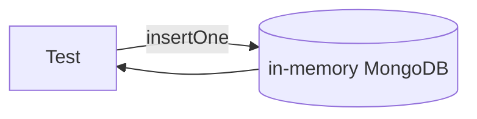

# Testing Strategy

## Tools

| Tool | Role |
|---|---|
| **Vitest** | Test runner — chosen over Jest for native ESM support and faster TS interop |
| **mongodb-memory-server** | In-process MongoDB — no running instance required for unit/integration tests |
| No RabbitMQ mock | AMQP interactions are tested via integration with real infra, or skipped |

Tests are **colocated** with source files: `event.schema.test.ts` lives next to `event.schema.ts`.

---

## What's Tested and How

### Schemas (`src/ingestion/event.schema.test.ts`)

**Type:** Unit — no setup, no teardown.

Tests that Zod accepts valid shapes and rejects invalid ones for each event type. Covers:
- Valid `pipeline`, `sensor`, and `app` payloads
- Missing required fields → `ZodError`
- Wrong `type` discriminator → `ZodError`
- Extra fields passthrough (Zod strips them with `.strip()`)

```ts
it("rejects a pipeline event with an invalid status", () => {
  const result = EventSchema.safeParse({ ...validPipeline, payload: { ...validPipeline.payload, status: "unknown" } });
  expect(result.success).toBe(false);
});
```

---

### Processors (`src/processing/processors/*.test.ts`)

**Type:** Unit — pure functions, no I/O.

`enrich.ts` and `classify.ts` take inputs and return outputs with no side effects. Straightforward to test:

```ts
it("classifies a failed pipeline event as critical", () => {
  const result = classify(enrichedPipelineEvent("failed"));
  expect(result.classification).toBe("critical");
});
```

---

### Repository (`src/storage/event.repository.test.ts`)

**Type:** Integration — uses `mongodb-memory-server`.



Covers:
- Insert a valid `StoredEvent` — verify it's retrievable
- Idempotent insert — inserting the same `raw.id` twice does not throw, returns the original
- `findById` — found and not-found cases
- `findMany` — pagination (`page`, `limit`), filter by `type`, filter by `status`
- Index creation on startup

**Setup/teardown pattern:**
```ts
let mongoServer: MongoMemoryServer;
beforeAll(async () => { mongoServer = await MongoMemoryServer.create(); ... });
afterAll(async () => { await mongoServer.stop(); });
```

---

### Routes (`src/ingestion/event.routes.test.ts`)

**Type:** Integration — uses Fastify's `inject()` (no real HTTP, no real RabbitMQ).

RabbitMQ's `publishEvent()` is mocked. MongoDB uses `mongodb-memory-server`.

Covers:
- `POST /events` with valid body → `202`
- `POST /events` with missing field → `422` with Zod issues in response
- `POST /events` with wrong `type` discriminator → `422`
- `GET /events` → paginated response shape
- `GET /events/:id` found → `200`
- `GET /events/:id` not found → `404`
- `GET /health` → `200`

```ts
it("returns 422 when type discriminator is invalid", async () => {
  const response = await app.inject({
    method: "POST",
    url: "/events",
    payload: { ...validEvent, type: "unknown" },
  });
  expect(response.statusCode).toBe(422);
});
```

---

### Worker (`src/processing/worker.test.ts`)

**Type:** Unit — mocks amqplib and the storage repository.

The AMQP channel and `saveEvent`/`saveFailedEvent` are mocked via `vi.mock()`. The message handler is captured from `channel.consume()` and invoked directly in tests.

Covers:
- Happy path: `saveEvent` called, `channel.ack()` fired
- Retry path: transient error increments `x-retry-count` header and republishes
- Dead-letter path: after 3 retries, `saveFailedEvent` called, `channel.nack()` fired
- Schema validation failure: invalid message nacked without calling storage
- Null message (broker cancellation): no ack/nack

---

### Metrics (`src/observation/metrics.test.ts`)

**Type:** Unit — mocks MongoDB and stubs `fetch` + timers.

Uses `vi.useFakeTimers()` + `vi.setSystemTime()` to pin the clock and `vi.advanceTimersByTimeAsync()` to trigger the stats interval without real time passing.

Covers:
- Stats message broadcast on each tick
- All required `StatsPayload` fields present
- MongoDB count values flow into the payload
- Queue depth warning/critical thresholds reflected in `queueDepthStatus`
- `stopMetrics()` prevents further broadcasts
- `processingRatePerSec` reflects `recordInsert()` calls within the window
- `changeStreamLagMs` reflects ObjectId timestamp lag

---

## What's Not Tested (and Why)

| Layer | Reason |
|---|---|
| **Change stream** | Requires a real MongoDB replica set — `mongodb-memory-server` supports it but it's slow and flaky. Verify manually. |
| **WebSocket broadcast** | Hard to test timing reliably. Covered by the dashboard manually. |
| **RabbitMQ worker** | AMQP channel mocks are fragile. The worker's logic (`enrich` + `classify` + `repository`) is tested individually. |
| **Graceful shutdown** | Process signal handling is hard to assert in tests. Verify manually with `Ctrl+C` during active load. |
| **Change stream delivery** | Requires a real MongoDB replica set — `mongodb-memory-server` supports it but adds significant test complexity. Verify manually. |

---

## Running Tests

```bash
# All tests
npm test

# Watch mode (re-runs on file save)
npm run test:watch

# With coverage
npx vitest run --coverage
```

## Test File Locations

```
src/
  ingestion/
    event.schema.ts
    event.routes.ts
    event.routes.test.ts       ← route integration tests (Fastify inject + vi.mock)
  processing/
    worker.ts
    worker.test.ts             ← worker unit tests (amqplib mocked)
    processors/
      enrich.ts
      enrich.test.ts           ← processor unit tests
      classify.ts
      classify.test.ts         ← processor unit tests
  storage/
    event.repository.ts
    event.repository.test.ts   ← repository integration tests (mongodb-memory-server)
  observation/
    metrics.ts
    metrics.test.ts            ← metrics unit tests (vi.useFakeTimers + fetch stub)
```
