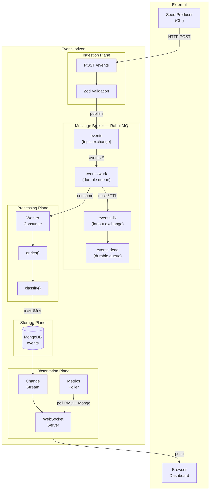
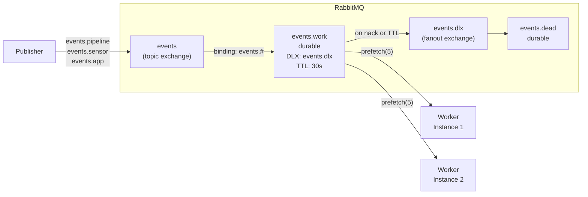
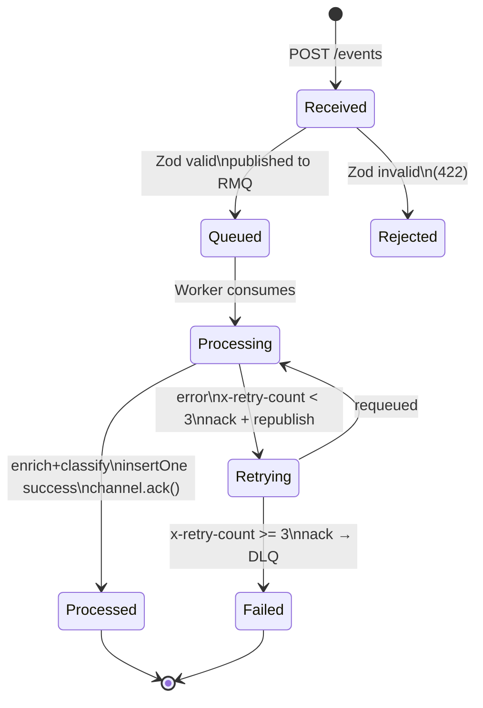
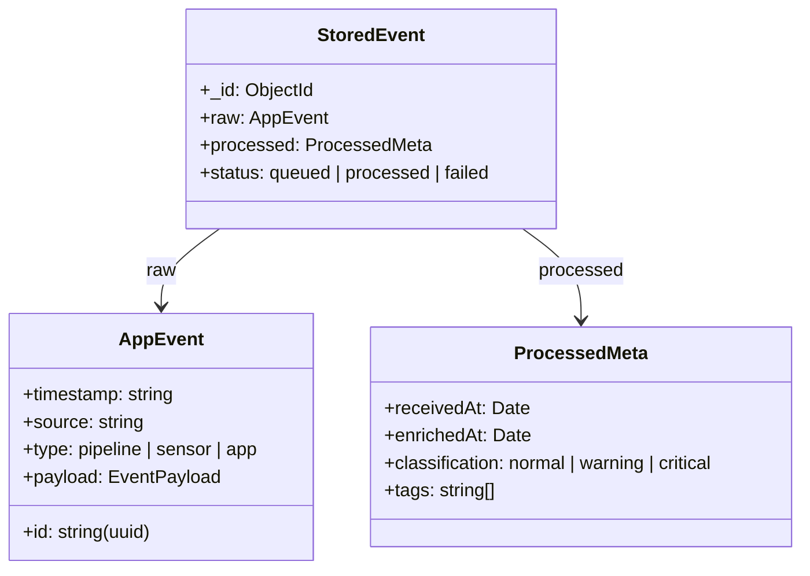

# EventHorizon — System Overview

High-level Mermaid diagrams for quick reference.

## Full System

```mermaid
flowchart TD
    subgraph External
        P["Seed Producer\n(CLI)"]
        B["Browser\nDashboard"]
    end

    subgraph EH["EventHorizon"]
        subgraph IP["Ingestion Plane"]
            R["POST /events"]
            Z["Zod Validation"]
        end

        subgraph MQ["Message Broker — RabbitMQ"]
            EX["events\n(topic exchange)"]
            WQ["events.work\n(durable queue)"]
            DLX["events.dlx\n(fanout exchange)"]
            DQ["events.dead\n(durable queue)"]
            EX -->|"events.#"| WQ
            WQ -->|"nack / TTL"| DLX
            DLX --> DQ
        end

        subgraph PP["Processing Plane"]
            W["Worker\nConsumer"]
            EN["enrich()"]
            CL["classify()"]
            W --> EN --> CL
        end

        subgraph SP["Storage Plane"]
            DB[("MongoDB\nevents")]
        end

        subgraph OP["Observation Plane"]
            CS["Change\nStream"]
            WS["WebSocket\nServer"]
            ME["Metrics\nPoller"]
        end
    end

    P -->|"HTTP POST"| R
    R --> Z
    Z -->|"publish"| EX
    WQ -->|"consume"| W
    CL -->|"insertOne"| DB
    DB --> CS
    CS --> WS
    ME -->|"poll RMQ + Mongo"| WS
    WS -->|"push"| B
```

## RabbitMQ Topology

```mermaid
flowchart LR
    PUB[Publisher] -->|"events.pipeline\nevents.sensor\nevents.app"| TE

    subgraph RMQ["RabbitMQ"]
        TE["events\n(topic exchange)"]
        WQ["events.work\ndurable\nDLX: events.dlx\nTTL: 30s"]
        DLE["events.dlx\n(fanout exchange)"]
        DLQ["events.dead\ndurable"]

        TE -->|"binding: events.#"| WQ
        WQ -->|"on nack or TTL"| DLE
        DLE --> DLQ
    end

    WQ -->|"prefetch(5)"| W1["Worker\nInstance 1"]
    WQ -->|"prefetch(5)"| W2["Worker\nInstance 2"]
```

## Event Lifecycle

```mermaid
stateDiagram-v2
    [*] --> Received: POST /events
    Received --> Queued: Zod valid\npublished to RMQ
    Received --> Rejected: Zod invalid\n(422)

    Queued --> Processing: Worker consumes
    Processing --> Processed: enrich+classify\ninsertOne success\nchannel.ack()
    Processing --> Retrying: error\nx-retry-count < 3\nnack + republish

    Retrying --> Processing: requeued
    Retrying --> Failed: x-retry-count >= 3\nnack → DLQ

    Processed --> [*]
    Failed --> [*]
```

## Data Model

```mermaid
classDiagram
    class StoredEvent {
        +_id: ObjectId
        +raw: AppEvent
        +processed: ProcessedMeta
        +status: queued | processed | failed
    }
    class AppEvent {
        +id: string (uuid)
        +timestamp: string
        +source: string
        +type: pipeline | sensor | app
        +payload: EventPayload
    }
    class ProcessedMeta {
        +receivedAt: Date
        +enrichedAt: Date
        +classification: normal | warning | critical
        +tags: string[]
    }
    StoredEvent --> AppEvent : raw
    StoredEvent --> ProcessedMeta : processed
```
