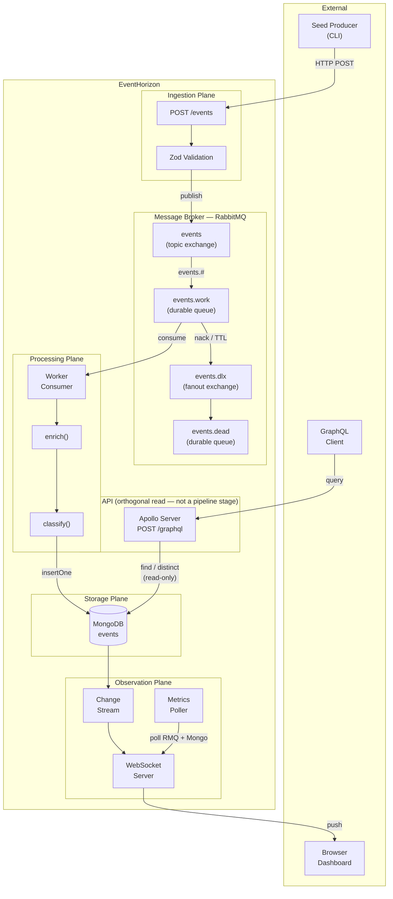
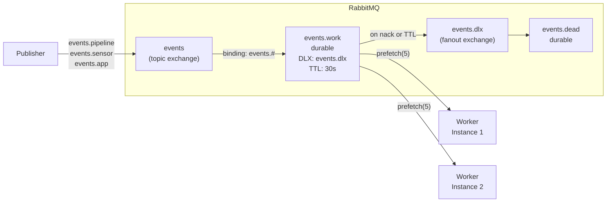
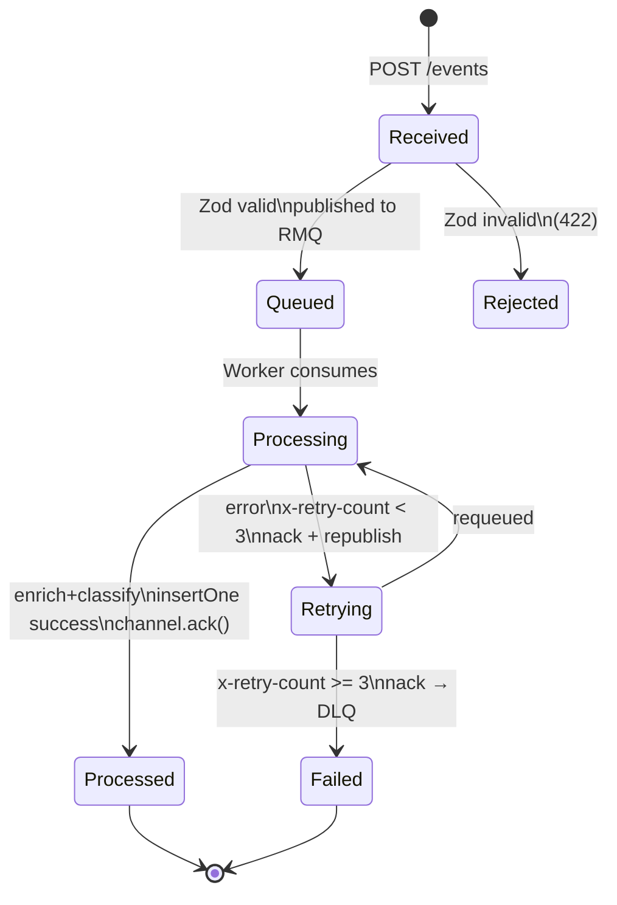
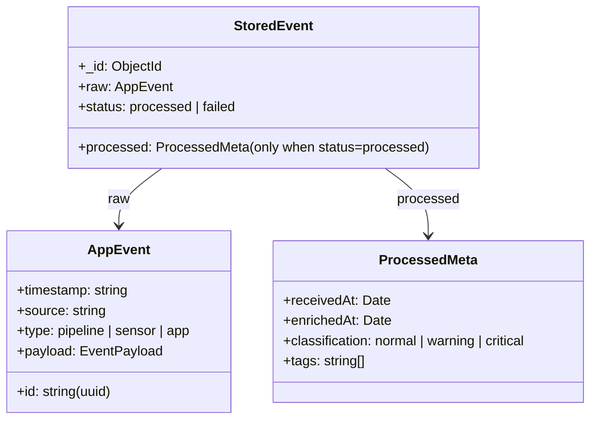
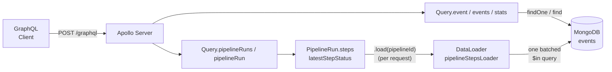
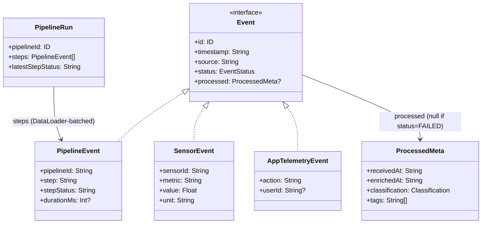

# EventHorizon — System Overview

High-level Mermaid diagrams for quick reference.

## Full System

## RabbitMQ Topology

## Event Lifecycle

## Data Model

## GraphQL Query API

Read-only Apollo Server layer over the Storage plane (ADR 0019) — sits beside the pipeline, not inside it; nothing here feeds back into Ingestion/Processing/Storage/Observation.

`Query.stats` reuses `getStatsSnapshot()` from `observation/metrics.ts` rather than re-querying — one implementation of "what counts as current stats," shared with the WebSocket broadcast interval.

### Schema

`Event` mirrors the same Zod discriminated union (`AppEvent`) the rest of the system already uses — the union tag becomes the interface's `__resolveType` discriminant, not a separately-invented data model.

