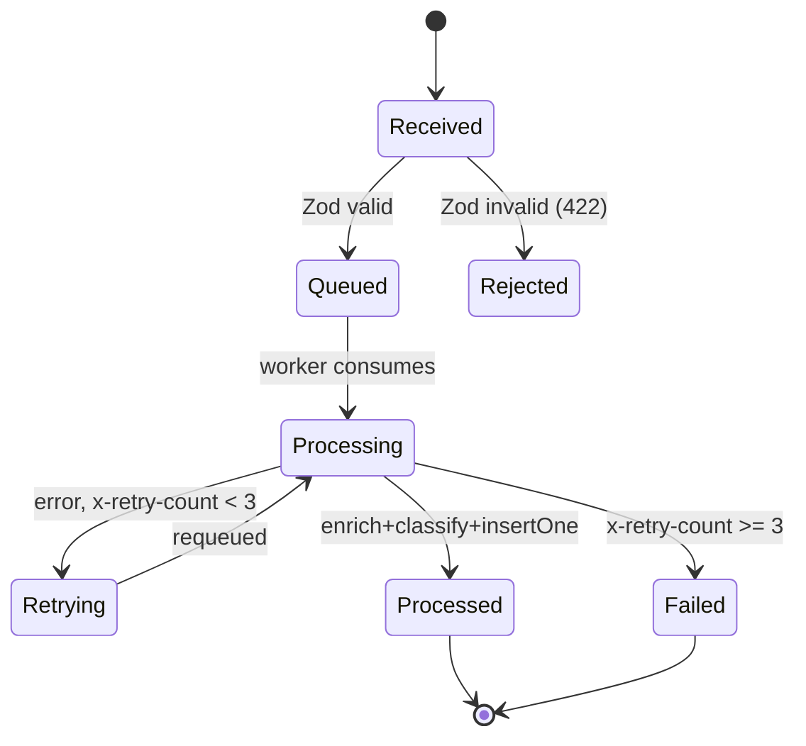

RabbitMQ distributes messages across multiple consumers of the same queue in {{c1::round-robin}} fashion. Combined with `{{c2::prefetch}}`, the broker only delivers up to `prefetch` unacknowledged messages per consumer — this is the {{c3::Competing Consumers}} pattern, horizontal scaling with no shared state.

Extra: EventHorizon · Phase 3 · Pattern: Competing Consumers
See: docs/journal/eventhorizon-2026-03-27T0915-worker-processors.md

---
type: cloze
deck: Rhizome::EventHorizon
tags: [eventhorizon, phase-3, rabbitmq, backpressure]
---
AMQP `{{c1::basic.qos}}` / `channel.prefetch(N)` caps the number of unacknowledged messages delivered to a single consumer. Without it, the broker floods one consumer with the entire queue, causing memory pressure and {{c2::head-of-line blocking}}.

Extra: EventHorizon · Phase 3 · Anti-Pattern Avoided: Unbounded Consumption ("The Prefetch Problem")
See: docs/journal/eventhorizon-2026-03-27T0915-worker-processors.md

---
type: cloze
deck: Rhizome::EventHorizon
tags: [eventhorizon, phase-3, rabbitmq, retry, anti-pattern]
---
`ch.nack(msg, false, true)` (requeue=true) puts a failed message at the {{c1::front}} of the queue — a poison message that always fails starves everything behind it ({{c2::head-of-line blocking}}). The correct retry pattern is to {{c3::ack the original and republish to the back}} of the queue with an incremented `x-retry-count` header.

Extra: EventHorizon · Phase 3 · Anti-Pattern Avoided: Head-of-Line Blocking via requeue=true
See: docs/journal/eventhorizon-2026-03-27T0915-worker-processors.md

---
type: basic
deck: Rhizome::EventHorizon
tags: [eventhorizon, phase-3, delivery-guarantees]
---
Q: Why does the EventHorizon worker call `ch.ack(msg)` only AFTER `saveEvent()` succeeds, rather than before?

A: Acking before the write would be at-most-once delivery — if the process crashes after the ack but before the write, the broker considers the message handled and it is permanently lost. Acking after the write is at-least-once: a crash before the ack causes RabbitMQ to redeliver the message, and the idempotent insert (unique index on `raw.id`, MongoDB error 11000 silently ignored) absorbs the resulting duplicate.

Extra: EventHorizon · Phase 3 · Pattern: At-Least-Once Delivery + Idempotent Receiver
See: docs/journal/eventhorizon-2026-03-27T0915-worker-processors.md

---
type: cloze
deck: Rhizome::EventHorizon
tags: [eventhorizon, phase-3, amqplib, architecture]
---
Although AMQP can multiplex multiple channels over {{c1::one connection}}, EventHorizon's worker calls `amqp.connect()` independently from `queue.ts` because the server and worker are {{c2::separate OS processes}} that can't share in-memory objects — separate connections also {{c3::isolate error domains}} between publisher and consumer channels.

Extra: EventHorizon · Phase 3 · Decision: Worker Owns Its Own AMQP Connection
See: docs/journal/eventhorizon-2026-03-27T0915-worker-processors.md

---
type: cloze
deck: Rhizome::EventHorizon
tags: [eventhorizon, phase-3, functional, testing]
---
A {{c1::pure function}} has no side effects and returns the same output for the same input. `enrich()` and `classify()` are pure, making them trivially {{c2::unit-testable}} (no mocks, stubs, or fake timers), composable, and reproducible from a single fixture event.

Extra: EventHorizon · Phase 3 · Pattern: Pure Function Processors
See: docs/journal/eventhorizon-2026-03-27T0915-worker-processors.md

---
type: image-occlusion
deck: Rhizome::EventHorizon
tags: [eventhorizon, phase-3, pipeline, state-machine]
diagram: eventhorizon-2026-03-27T0915-pipeline
---
occlusions:
  - node: Queued
    hint: what state follows a valid POST /events?
    rect: left=.35:top=.28:width=.22:height=.09
  - node: Retrying
    hint: what state handles transient worker errors?
    rect: left=.35:top=.55:width=.22:height=.09
  - node: Failed
    hint: terminal state when x-retry-count >= 3?
    rect: left=.52:top=.72:width=.18:height=.09

Header: EventHorizon pipeline — state transitions
Back Extra: EventHorizon · Phase 3 · Pattern: Dead Letter via Retry Exhaustion
See: docs/journal/eventhorizon-2026-03-27T0915-worker-processors.md

