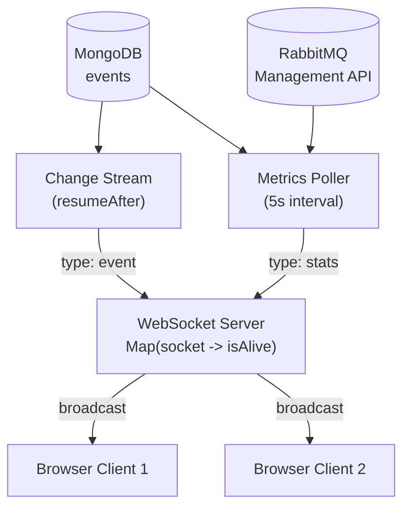

Change streams require MongoDB's {{c1::oplog}} — a capped collection recording every write, used for replication. A standalone instance has no oplog, so `watch()` throws `MongoServerError`. Running as a {{c2::single-node replica set}} (`--replSet rs0`) adds the oplog without requiring multiple nodes.

Extra: EventHorizon · Phase 4 · Pattern: Event-Driven Push (Change Streams)
See: docs/journal/eventhorizon-2026-03-28T0915-observation-plane.md

---
type: cloze
deck: Rhizome::EventHorizon
tags: [eventhorizon, phase-4, mongodb, docker]
---
In docker-compose, a replica set member reports its {{c1::container hostname}} to the driver during topology discovery — unreachable from the host machine. `{{c2::directConnection=true}}` skips discovery and connects directly to the URI's host; change streams still work because the node IS a replica set member.

Extra: EventHorizon · Phase 4 · Pattern: Event-Driven Push (Change Streams)
See: docs/journal/eventhorizon-2026-03-28T0915-observation-plane.md

---
type: cloze
deck: Rhizome::EventHorizon
tags: [eventhorizon, phase-4, websocket, fan-out]
---
`broadcast()` wraps `socket.send()` in a {{c1::try/catch per client}}. If it throws, that client is removed from the `Map` and the loop continues — a single bad client never blocks {{c2::fan-out}} to the rest.

Extra: EventHorizon · Phase 4 · Pattern: Fan-out
See: docs/journal/eventhorizon-2026-03-28T0915-observation-plane.md

---
type: cloze
deck: Rhizome::EventHorizon
tags: [eventhorizon, phase-4, websocket, data-structures]
---
Fan-out alone only needs a `Set<WebSocket>`, but zombie detection requires per-client state — `{{c1::isAlive}}`. A `{{c2::Map<WebSocket, boolean>}}` stores both the socket and its liveness flag in one structure.

Extra: EventHorizon · Phase 4 · Anti-Pattern Avoided: Zombie Connections
See: docs/journal/eventhorizon-2026-03-28T0915-observation-plane.md

---
type: cloze
deck: Rhizome::EventHorizon
tags: [eventhorizon, phase-4, websocket, heartbeat]
---
Every `PING_INTERVAL_MS` (30s), a client with `isAlive === false` is a {{c1::zombie}}: `socket.terminate()` and remove from the Map. A live client (`isAlive === true`) is reset to `false` and sent `{ type: "ping" }`; receiving `{{c2::"pong"}}` sets `isAlive = true` again.

Extra: EventHorizon · Phase 4 · Anti-Pattern Avoided: Zombie Connections
See: docs/journal/eventhorizon-2026-03-28T0915-observation-plane.md

---
type: cloze
deck: Rhizome::EventHorizon
tags: [eventhorizon, phase-4, nodejs, event-loop]
---
`heartbeat.unref()` marks the heartbeat `setInterval` as a {{c1::background handle}} — it still fires on schedule, but won't prevent the Node.js process from {{c2::exiting naturally}} once all other handles (HTTP, WS, MongoDB) have closed during shutdown.

Extra: EventHorizon · Phase 4 · Anti-Pattern Avoided: Zombie Connections
See: docs/journal/eventhorizon-2026-03-28T0915-observation-plane.md

---
type: basic
deck: Rhizome::EventHorizon
tags: [eventhorizon, phase-4, architecture, process-boundaries]
---
Q: Why is the change stream wired into the server process rather than the worker process, even though the worker is the one writing to MongoDB?

A: The worker and server are separate OS processes with no shared memory — `broadcast()` holds live WebSocket client sockets that only exist in the server process, so the worker physically cannot call it. MongoDB acts as the decoupling boundary: the worker writes, the oplog records it, and the server's change stream picks it up and fans out to clients. Putting the change stream in the worker would require a new IPC channel (Redis pub/sub, internal HTTP call, another queue) to reach the server's sockets — reinventing a message bus that MongoDB's oplog already provides for free.

Extra: EventHorizon · Phase 4 · Decision: Change Stream Lives in the Server Process, Not the Worker
See: docs/journal/eventhorizon-2026-03-28T0915-observation-plane.md

---
type: image-occlusion
deck: Rhizome::EventHorizon
tags: [eventhorizon, phase-4, observation-plane, topology]
diagram: eventhorizon-2026-03-28T0915-observation-topology
---
occlusions:
  - node: CS
    hint: which component reads MongoDB's oplog via resumeAfter and pushes type: event messages?
    rect: left=.08:top=.24:width=.27:height=.10
  - node: ME
    hint: which component polls RabbitMQ + MongoDB every STATS_PUSH_INTERVAL_MS and pushes type: stats messages?
    rect: left=.55:top=.24:width=.32:height=.10
  - node: WS
    hint: which component holds the Map of socket to isAlive and fans out to all connected clients?
    rect: left=.28:top=.45:width=.38:height=.10

Header: EventHorizon — Observation plane topology
Back Extra: EventHorizon · Phase 4 · Pattern: Event-Driven Push (Change Streams) / Fan-out
See: docs/journal/eventhorizon-2026-03-28T0915-observation-plane.md

