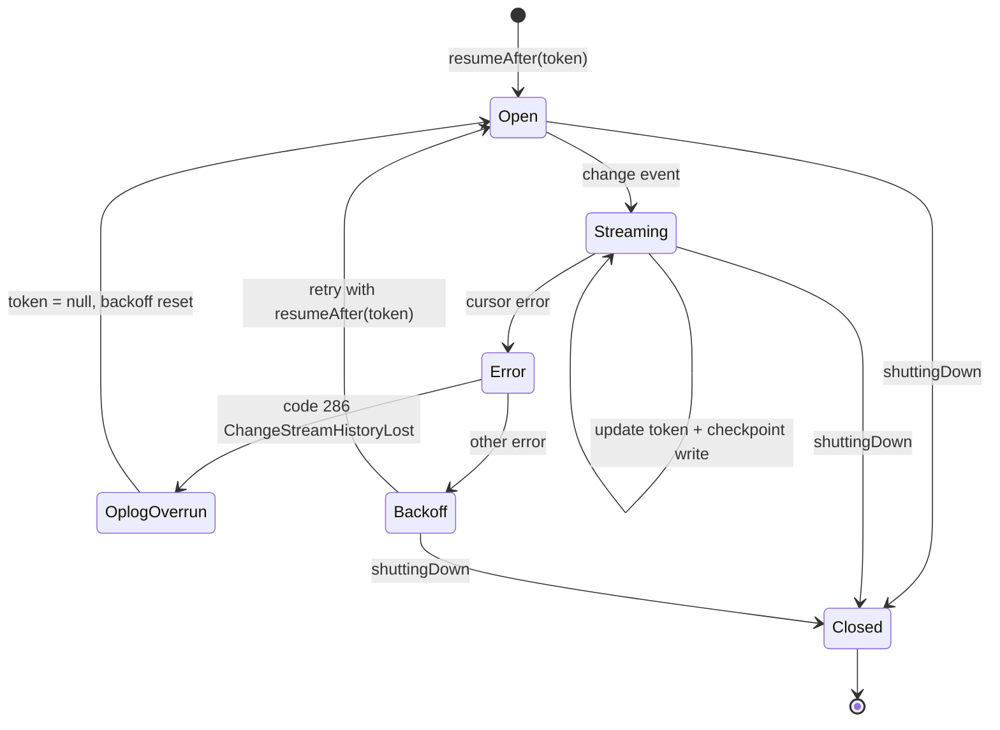

A checkpoint is an externally persisted record of how far a consumer has processed. Kafka commits {{c1::consumer offsets}} to an internal topic; Flink snapshots {{c2::operator state}} to object storage; Debezium persists its {{c3::WAL position}}. EventHorizon persists the MongoDB change stream resume token to a `changestream_checkpoints` collection. The invariant across all of these: the checkpoint is written {{c4::after delivery}}, so the consumer can always restart and replay anything it might have missed.

Extra: EventHorizon · Phase 11 · Pattern: Durable Checkpoint
See: docs/journal/eventhorizon-2026-06-03T0900-durable-checkpoint.md

---
type: basic
deck: Rhizome::EventHorizon
tags: [eventhorizon, phase-11, architecture, decision]
---
Q: ADR-0011 raised a "circular dependency" concern about persisting the resume token in MongoDB — needing Mongo to load the token in order to reconnect to Mongo. Why does Phase 11 conclude this isn't actually a blocker, and choose MongoDB over Redis?

A: If MongoDB is completely unavailable at startup, the change stream can't be opened regardless of where the token lives — the token is irrelevant until MongoDB is reachable. Once MongoDB is reachable, both loading the token and opening the stream become possible. The "circular dependency" collapses to "if Mongo is down, we wait until it's up" — which was already true before this change. No new infrastructure (Redis) is needed.

Extra: EventHorizon · Phase 11 · Pattern: Durable Checkpoint
See: docs/journal/eventhorizon-2026-06-03T0900-durable-checkpoint.md

---
type: cloze
deck: Rhizome::EventHorizon
tags: [eventhorizon, phase-11, mongodb, change-streams]
---
MongoDB's oplog has a configurable retention window. If a pod is down long enough that the oplog rolls past the position in a persisted resume token, reopening the stream with that stale token fails with error code `{{c1::286}}` (`{{c2::ChangeStreamHistoryLost}}`). The fix: detect this code, clear the checkpoint, reset to `{{c3::null}}`, and restart from the current oplog head — accepting the gap.

Extra: EventHorizon · Phase 11 · Pattern: Oplog Overrun Recovery (ChangeStreamHistoryLost)
See: docs/journal/eventhorizon-2026-06-03T0900-durable-checkpoint.md

---
type: cloze
deck: Rhizome::EventHorizon
tags: [eventhorizon, phase-11, backoff, mongodb]
---
On an oplog overrun, the exponential backoff delay is {{c1::reset}}, not preserved. The backoff exists to avoid hammering an unavailable MongoDB — but an oplog overrun means MongoDB is {{c2::healthy}}; the problem was the stale token, not an outage. Preserving the backoff would add unnecessary delay to a clean recovery.

Extra: EventHorizon · Phase 11 · Pattern: Oplog Overrun Recovery (ChangeStreamHistoryLost)
See: docs/journal/eventhorizon-2026-06-03T0900-durable-checkpoint.md

---
type: cloze
deck: Rhizome::EventHorizon
tags: [eventhorizon, phase-11, k3s, anti-pattern]
---
Storing a stateful consumer's position only in process memory implicitly assumes the consumer never restarts — an assumption k3s violates routinely (pod evictions, rolling deploys, OOM kills). If the change stream's resume token is lost on restart, events inserted during the outage are durably stored in MongoDB but never reach the change stream cursor — the dashboard's {{c1::live feed}} and the stored {{c2::event count}} diverge with {{c3::no observable signal}} to the operator.

Extra: EventHorizon · Phase 11 · Anti-Pattern Avoided: Ephemeral State in a Stateful Consumer
See: docs/journal/eventhorizon-2026-06-03T0900-durable-checkpoint.md

---
type: basic
deck: Rhizome::EventHorizon
tags: [eventhorizon, phase-11, delivery-guarantees, tradeoff]
---
Q: Why is `saveResumeToken()` called fire-and-forget (not awaited) in the change event handler, and what delivery guarantee does this give the checkpoint mechanism?

A: Awaiting the checkpoint write would add a MongoDB round-trip to every event delivery, blocking the change stream handler and potentially throttling throughput on high-volume pipelines. The failure mode of a missed write is mild: on the next restart the token is slightly older than the last delivered event, so a few events replay — and the idempotent receiver in event.repository.ts silently absorbs those duplicates via the unique index. This makes the checkpoint at-least-once (not exactly-once), which never breaks anything, only causes occasional replay. If this proves too imprecise, the next step is write-ahead: persist the token before delivering, at the cost of a synchronous write per event.

Extra: EventHorizon · Phase 11 · Decision: Fire-and-Forget Checkpoint Writes
See: docs/journal/eventhorizon-2026-06-03T0900-durable-checkpoint.md

---
type: cloze
deck: Rhizome::EventHorizon
tags: [eventhorizon, phase-11, typescript, mongodb]
---
`getDb().collection()` defaults to `Collection<Document>`, where `_id` is typed as `{{c1::ObjectId}}`. Filtering by a string `_id` (e.g. `{ _id: "observation" }`) fails the TypeScript check. The fix is a `{{c2::col()}}` helper that returns `collection<CheckpointDoc>(COLLECTION)`, centralizing the `{{c3::_id: string}}` generic in one place rather than repeating it at every call site.

Extra: EventHorizon · Phase 11 · Decision: col() Helper for Collection Typing
See: docs/journal/eventhorizon-2026-06-03T0900-durable-checkpoint.md

---
type: image-occlusion
deck: Rhizome::EventHorizon
tags: [eventhorizon, phase-9, phase-11, mongodb, change-streams, state-machine]
diagram: eventhorizon-2026-06-03T0900-cursor-lifecycle
---
occlusions:
  - node: Streaming
    hint: which state updates the resume token and fires off a checkpoint write before broadcasting?
    rect: left=.35:top=.18:width=.30:height=.10
  - node: OplogOverrun
    hint: which state is entered on error code 286 (ChangeStreamHistoryLost)?
    rect: left=.10:top=.45:width=.32:height=.10
  - node: Backoff
    hint: which state schedules a retry with exponential delay before reopening the stream?
    rect: left=.55:top=.45:width=.28:height=.10
  - node: Closed
    hint: which state requires shuttingDown = true before clearTimeout, before stream.close()?
    rect: left=.35:top=.72:width=.30:height=.10

Header: EventHorizon — Change stream cursor lifecycle
Back Extra: EventHorizon · Phase 9/11 · Pattern: Change Stream Resume with Resume Token / Durable Checkpoint
See: docs/journal/eventhorizon-2026-06-03T0900-durable-checkpoint.md

