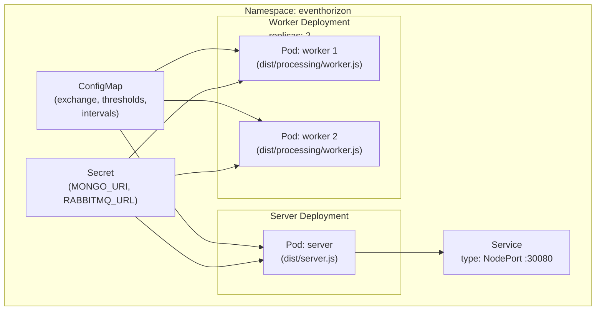

ConfigMaps are stored plaintext in etcd and visible to anyone with `kubectl get configmap`; Secrets are base64-encoded (not encrypted by default, but can be with a KMS provider) and have separate RBAC controls. `{{c1::MONGO_URI}}` and `{{c2::RABBITMQ_URL}}` contain passwords and belong in a Secret; exchange names, thresholds, and intervals are non-sensitive and belong in a {{c3::ConfigMap}} — enforcing the principle of {{c4::least privilege}}.

Extra: EventHorizon · Phase 14 · Pattern: ConfigMap + Secret Separation
See: docs/journal/eventhorizon-2026-06-03T0945-k3s-manifests.md

---
type: cloze
deck: Rhizome::EventHorizon
tags: [eventhorizon, phase-14, k3s, competing-consumers]
---
The worker Deployment sets `{{c1::replicas: 2}}`. RabbitMQ distributes messages {{c2::round-robin}} across all consumers on the queue, so two replicas means double the throughput. This is safe because the unique index on `raw.id` makes the storage layer an {{c3::idempotent receiver}} — if two workers race to insert the same redelivered event, one write succeeds and the other is silently swallowed (error 11000).

Extra: EventHorizon · Phase 14 · Pattern: Competing Consumers at the Deployment Level
See: docs/journal/eventhorizon-2026-06-03T0945-k3s-manifests.md

---
type: cloze
deck: Rhizome::EventHorizon
tags: [eventhorizon, phase-14, anti-pattern, k3s]
---
Leaving `replicas: 1` on the worker Deployment creates a single point of failure and throughput ceiling, with no correctness benefit once idempotent inserts are in place. This anti-pattern is named {{c1::Single-Consumer Queue}} — it converts a scalable message queue into a {{c2::serialised work queue}}.

Extra: EventHorizon · Phase 14 · Anti-Pattern Avoided: Single-Replica Worker Bottleneck (Single-Consumer Queue)
See: docs/journal/eventhorizon-2026-06-03T0945-k3s-manifests.md

---
type: basic
deck: Rhizome::EventHorizon
tags: [eventhorizon, phase-14, k3s, networking]
---
Q: Why does the server Service use type: NodePort instead of ClusterIP + Ingress, and what would change in production?

A: NodePort (port 30080) makes the service reachable from the host machine without configuring an Ingress controller — convenient for local k3s development. In production you'd use type: ClusterIP with an Ingress resource (e.g. Traefik, which ships with k3s by default, or nginx-ingress), which adds TLS termination, virtual hosting, and path-based routing — none of which are needed for a development-first learning project.

Extra: EventHorizon · Phase 14 · Decision: NodePort for Development, Ingress for Production
See: docs/journal/eventhorizon-2026-06-03T0945-k3s-manifests.md

---
type: cloze
deck: Rhizome::EventHorizon
tags: [eventhorizon, phase-14, k3s, health-checks]
---
The worker has no HTTP server, so it can't use an `httpGet` liveness probe. Of the three options — minimal HTTP server just for probing, exec probe via heartbeat file, or relying on `{{c1::restartPolicy: Always}}` — Phase 14 chooses the third for now. If the worker process exits (crash, unhandled rejection), k3s restarts it immediately; the {{c2::exec probe}} is documented as a TODO in `worker.yaml` for when silent hangs become a concern.

Extra: EventHorizon · Phase 14 · Decision: No Liveness Probe on the Worker
See: docs/journal/eventhorizon-2026-06-03T0945-k3s-manifests.md

---
type: image-occlusion
deck: Rhizome::EventHorizon
tags: [eventhorizon, phase-14, k3s, topology]
diagram: eventhorizon-2026-06-03T0945-k3s-topology
---
occlusions:
  - node: CM
    hint: which resource holds non-sensitive config (exchange names, thresholds, intervals)?
    rect: left=.04:top=.06:width=.28:height=.12
  - node: SEC
    hint: which resource holds MONGO_URI and RABBITMQ_URL?
    rect: left=.38:top=.06:width=.28:height=.12
  - node: SVC
    hint: which resource type makes the server reachable on a host port (30080) without an Ingress controller?
    rect: left=.65:top=.55:width=.32:height=.12
  - node: WD
    hint: which Deployment runs 2 replicas to act as competing consumers?
    rect: left=.28:top=.55:width=.34:height=.22

Header: EventHorizon — k3s topology
Back Extra: EventHorizon · Phase 14 · Pattern: ConfigMap + Secret Separation / Competing Consumers at the Deployment Level
See: docs/journal/eventhorizon-2026-06-03T0945-k3s-manifests.md

