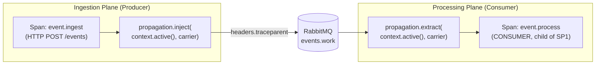

`import "./observation/tracing.js"` is placed as the first line of each entry point because ESM module evaluation is {{c1::depth-first, left-to-right}} — the first import in a module's static import list is fully evaluated before any subsequent import. This guarantees `{{c2::sdk.start()}}` completes before `app.ts`, `amqplib`, or MongoDB are evaluated — a spec-level guarantee, not a tsx or Node implementation detail.

Extra: EventHorizon · Phase 15 · Pattern: First-Import SDK Bootstrap (ESM)
See: docs/journal/eventhorizon-2026-06-06T0900-otel-instrumentation.md

---
type: cloze
deck: Rhizome::EventHorizon
tags: [eventhorizon, phase-15, opentelemetry, testing, observability]
cross-ref: observability
---
Vitest imports test files and their transitive dependencies directly, never through `server.ts`/`worker.ts`, so `NodeSDK.start()` never runs in tests. `@opentelemetry/api` falls back to a `{{c1::NoopTracerProvider}}` when no SDK is registered — `trace.getActiveSpan()` returns `{{c2::undefined}}`, `propagation.inject()` is a no-op, and `context.with()` just calls the callback. Zero test changes needed.

Extra: EventHorizon · Phase 15 · Pattern: First-Import SDK Bootstrap (ESM)
See: docs/journal/eventhorizon-2026-06-06T0900-otel-instrumentation.md

---
type: cloze
deck: Rhizome::EventHorizon
tags: [eventhorizon, phase-15, opentelemetry, observability]
cross-ref: observability
---
A Prometheus counter commits to a specific aggregation at write time — once `events_by_type_total{type="sensor"}` exists, you cannot later ask "which sensor events came from source X" because source wasn't a {{c1::label}}. Span attributes are stored raw and queryable in any combination via {{c2::TraceQL}}. The project's posture: counters only for {{c3::alerting signals}} (queue depth, error rate); everything analytics-shaped stays on spans.

Extra: EventHorizon · Phase 15 · Pattern: Wide Span Attributes Over Pre-Aggregated Counters
See: docs/journal/eventhorizon-2026-06-06T0900-otel-instrumentation.md

---
type: cloze
deck: Rhizome::EventHorizon
tags: [eventhorizon, phase-15, opentelemetry, rabbitmq, observability]
cross-ref: observability
---
To continue a trace across a RabbitMQ publish/consume boundary, the publisher calls `{{c1::propagation.inject(context.active(), carrier)}}` to write the current span's trace/span ID into a plain object passed as `properties.headers`. The consumer calls `{{c2::propagation.extract(context.active(), carrier)}}` to reconstruct a Context containing the parent span reference, using the {{c3::W3C TraceContext}} wire format (`traceparent: 00-<trace-id>-<span-id>-<flags>`).

Extra: EventHorizon · Phase 15 · Pattern: Async Boundary Context Propagation (RabbitMQ)
See: docs/journal/eventhorizon-2026-06-06T0900-otel-instrumentation.md

---
type: cloze
deck: Rhizome::EventHorizon
tags: [eventhorizon, phase-15, opentelemetry, anti-pattern, observability]
cross-ref: observability
---
Before Phase 15, a message with malformed JSON or schema mismatch entered the retry loop with no signal beyond `console.error` — the same error could recur thousands of times invisibly. The fix: `{{c1::span.addEvent("message.parse_failed", {...})}}` on `SyntaxError`/`ZodError`, carrying `exception.type`, `exception.message`, `msg.routing_key`, and `retry.count` — queryable via a single {{c2::TraceQL}} query across any time window.

Extra: EventHorizon · Phase 15 · Anti-Pattern Avoided: Silent Error Retry (Treating Parse Failures as Invisible Retries)
See: docs/journal/eventhorizon-2026-06-06T0900-otel-instrumentation.md

---
type: basic
deck: Rhizome::EventHorizon
tags: [eventhorizon, phase-15, opentelemetry, observability]
cross-ref: observability
---
Q: How do manual spans and auto-instrumentation divide responsibilities in EventHorizon's OTel setup, and when do you use trace.getActiveSpan() vs tracer.startSpan()?

A: Auto-instrumentation (getNodeAutoInstrumentations()) covers low-level I/O — HTTP requests, MongoDB operations, amqplib publish/consume — providing the structural skeleton (how long did the MongoDB write take?). Manual spans are added only on business-critical operations (event.process, event.observe) to carry domain attributes auto-instrumentation can't know (classification, subscribers.count, changeStream.lag_ms) — the analytical slice. Use trace.getActiveSpan() to widen a span a framework already created (e.g. adding attributes to the Fastify HTTP span in event.routes.ts). Use tracer.startSpan() when you need a new named span with its own start/end times and a specific parent context (e.g. the event.process CONSUMER span in worker.ts).

Extra: EventHorizon · Phase 15 · Decision: Manual Spans on Business Paths, Auto-Instrumentation as Baseline
See: docs/journal/eventhorizon-2026-06-06T0900-otel-instrumentation.md

---
type: cloze
deck: Rhizome::EventHorizon
tags: [eventhorizon, phase-15, amqplib, opentelemetry, observability]
cross-ref: observability
---
When the worker reads `msg.properties.headers`, the `x-retry-count` field arrives as a `{{c1::Buffer}}` object, not a number or string — but `propagation.extract()` expects `Record<string, string>`. The fix filters headers to {{c2::string-valued keys only}} before extraction, preserving `traceparent` and discarding `x-retry-count`; the retry count is read separately from the raw headers object before this filter runs.

Extra: EventHorizon · Phase 15 · Challenge: amqplib Encodes Non-String Header Values as Buffer Objects
See: docs/journal/eventhorizon-2026-06-06T0900-otel-instrumentation.md

---
type: basic
deck: Rhizome::EventHorizon
tags: [eventhorizon, phase-15, amqplib, opentelemetry, observability]
cross-ref: observability
---
Q: What would happen if the worker passed amqplib's raw, unfiltered message headers directly to propagation.extract() instead of filtering to string-valued keys first?

A: The W3C TraceContext propagator's type check on headers["traceparent"] would fail because amqplib decodes header values as Buffer objects, not strings. propagation.extract() would silently return the root (empty) context — no error thrown — so the incoming trace would be orphaned: the new span starts as the root of its own trace instead of a child of the publisher's span, visible in Tempo as disconnected traces instead of one parent/child waterfall.

Extra: EventHorizon · Phase 15 · Challenge: amqplib Encodes Non-String Header Values as Buffer Objects
See: docs/journal/eventhorizon-2026-06-06T0900-otel-instrumentation.md

---
type: image-occlusion
deck: Rhizome::EventHorizon
tags: [eventhorizon, phase-15, opentelemetry, rabbitmq, observability]
cross-ref: observability
diagram: eventhorizon-2026-06-06T0900-trace-propagation
---
occlusions:
  - node: INJ
    hint: which call writes the active span's trace/span IDs into the carrier object before publish?
    rect: left=.06:top=.40:width=.26:height=.12
  - node: MQ
    hint: where does the carrier object travel as part of the RabbitMQ message?
    rect: left=.38:top=.42:width=.22:height=.16
  - node: EXT
    hint: which call reconstructs a parent Context from the carrier on the consumer side?
    rect: left=.66:top=.18:width=.26:height=.12
  - node: SP2
    hint: what kind of span is created using the extracted context as its parent, on the same trace as SP1?
    rect: left=.66:top=.55:width=.30:height=.12

Header: EventHorizon — Trace propagation across RabbitMQ
Back Extra: EventHorizon · Phase 15 · Pattern: Async Boundary Context Propagation (RabbitMQ)
See: docs/journal/eventhorizon-2026-06-06T0900-otel-instrumentation.md

