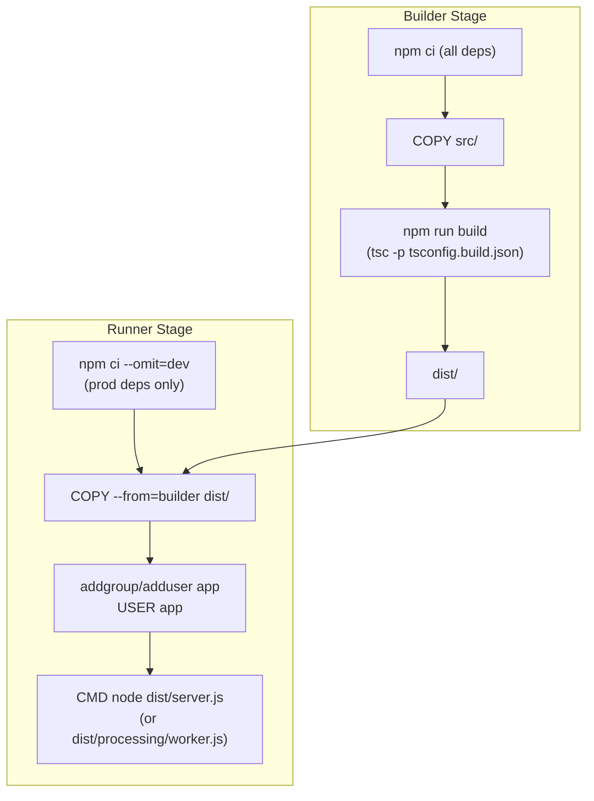

A single-stage Docker build that compiles TypeScript would carry devDependencies (`tsx`, `typescript`, `vitest`, `mongodb-memory-server`) into the production image, bloating it {{c1::4–5×}}. The {{c2::builder}} stage installs all dependencies and compiles to `dist/`; the {{c3::runner}} stage starts fresh, runs `npm ci --omit=dev`, and copies only `dist/` from the builder.

Extra: EventHorizon · Phase 12 · Pattern: Multi-Stage Docker Build
See: docs/journal.md#phase-12-dockerfile

---
type: cloze
deck: Rhizome::EventHorizon
tags: [eventhorizon, phase-12, docker, security]
---
Docker containers run as root by default, and k3s security policies (PodSecurityAdmission, OPA Gatekeeper) often reject root pods. The fix: `{{c1::addgroup -S app && adduser -S app -G app}}` creates a system user, and `{{c2::USER app}}` before `CMD` drops privileges. The `-S` flag creates a system account with no password and no login shell.

Extra: EventHorizon · Phase 12 · Anti-Pattern Avoided: Running as Root in a Container
See: docs/journal.md#phase-12-dockerfile

---
type: cloze
deck: Rhizome::EventHorizon
tags: [eventhorizon, phase-12, docker, k3s]
---
Server and worker share the entire codebase, so EventHorizon uses {{c1::one image, two entry points}} rather than two Dockerfiles. The server Deployment uses the default `{{c2::CMD ["node", "dist/server.js"]}}`; the worker Deployment overrides it with `command: ["node", "dist/processing/worker.js"]` in the k3s manifest — avoiding duplicated build steps that could drift out of sync.

Extra: EventHorizon · Phase 12 · Decision: Single Image, Two Entry Points
See: docs/journal.md#phase-12-dockerfile

---
type: cloze
deck: Rhizome::EventHorizon
tags: [eventhorizon, phase-12, typescript, build]
---
The root `tsconfig.json` includes `src/**/*`, which covers `*.test.ts` files — compiling them is harmless but adds noise and test-only imports to the image. `{{c1::tsconfig.build.json}}` extends the base config and adds `{{c2::"exclude": ["src/**/*.test.ts"]}}`, keeping `dist/` clean, while the `typecheck` script still uses the root tsconfig so tests remain type-checked in CI.

Extra: EventHorizon · Phase 12 · Decision: tsconfig.build.json for Production Compilation
See: docs/journal.md#phase-12-dockerfile

---
type: basic
deck: Rhizome::EventHorizon
tags: [eventhorizon, phase-12, typescript, build]
---
Q: After adding tsconfig.build.json to exclude *.test.ts from production builds, old *.test.js files remained in dist/ from previous compilations. Why, and what's the fix?

A: tsc does not delete previously compiled files that fall outside a new compilation scope — it only adds/updates files within scope. Excluding test files only prevents new compilations of them; stale .test.js artifacts from earlier runs remain untouched. The fix is to clean before compiling: "build": "rm -rf dist/ && tsc -p tsconfig.build.json". Without this, the first build after adding the exclude appears to work but silently ships stale test artifacts.

Extra: EventHorizon · Phase 12 · Challenge: Stale dist/ From Incremental tsc
See: docs/journal.md#phase-12-dockerfile

---
type: cloze
deck: Rhizome::EventHorizon
tags: [eventhorizon, phase-12, config, k3s]
---
`import "dotenv/config"` in `config.ts` is a {{c1::no-op}} when no `.env` file exists — dotenv silently ignores missing files. In k3s, env vars are injected from {{c2::ConfigMap/Secret}} references before the process starts, so `process.env` is already populated by the time Zod validation runs. Running the worker image with no env vars produces the correct Zod error and exits {{c3::1}}, confirming the config boundary works.

Extra: EventHorizon · Phase 12 · Challenge: dotenv No-Op in Production
See: docs/journal.md#phase-12-dockerfile

---
type: image-occlusion
deck: Rhizome::EventHorizon
tags: [eventhorizon, phase-12, docker, build]
diagram: phase-12-docker-build
---
occlusions:
  - node: B3
    hint: which build-stage step compiles with tsconfig.build.json, excluding *.test.ts?
    rect: left=.06:top=.32:width=.36:height=.10
  - node: DIST
    hint: what's the only artifact copied from the builder stage into the runner stage?
    rect: left=.06:top=.46:width=.22:height=.09
  - node: R1
    hint: which runner-stage step installs only production dependencies?
    rect: left=.55:top=.10:width=.38:height=.10
  - node: R3
    hint: which runner-stage step creates and switches to a non-root system user?
    rect: left=.55:top=.40:width=.38:height=.10

Header: EventHorizon — Docker multi-stage build pipeline
Back Extra: EventHorizon · Phase 12 · Pattern: Multi-Stage Docker Build
See: docs/journal.md#phase-12-dockerfile

