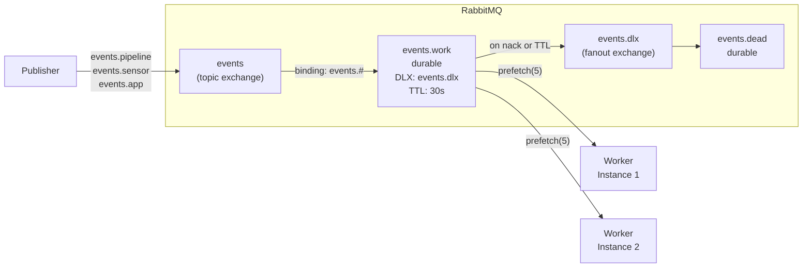

For a RabbitMQ message to survive a broker restart, three things must all be true: the exchange is `{{c1::durable: true}}`, the queue is `{{c2::durable: true}}`, and each message is published with `{{c3::persistent: true}}` (deliveryMode 2). Any one missing means messages are lost on restart.

Extra: EventHorizon · Phase 3 · Pattern: Publisher-Subscriber with Durable Topic Exchange
See: docs/journal.md#phase-3-rabbitmq-topology

---
type: cloze
deck: Rhizome::EventHorizon
tags: [eventhorizon, phase-3, rabbitmq, idempotent]
---
`channel.assertQueue()` is a {{c1::no-op}} if the arguments match an existing queue exactly. If the arguments differ, RabbitMQ throws `{{c2::406 PRECONDITION_FAILED}}` — safe to call on every startup, but dangerous to change arguments on a live queue.

Extra: EventHorizon · Phase 3 · Pattern: Idempotent Topology Declaration
See: docs/journal.md#phase-3-rabbitmq-topology

---
type: cloze
deck: Rhizome::EventHorizon
tags: [eventhorizon, phase-3, nodejs, amqplib]
---
If an `'error'` event is emitted on a Node.js EventEmitter with no listener registered, Node.js throws it as an {{c1::uncaught exception}}, crashing the process. `amqplib` Connection and Channel objects are EventEmitters — both need `{{c2::.on('error', handler)}}` registered.

Extra: EventHorizon · Phase 3 · Failure Mode First: src/processing/queue.ts
See: docs/journal.md#phase-3-rabbitmq-topology

---
type: cloze
deck: Rhizome::EventHorizon
tags: [eventhorizon, phase-3, amqplib, anti-pattern, testing]
---
A module-level `await amqp.connect(...)` at the top of `queue.ts` is the {{c1::Module-Level Side Effects}} anti-pattern: top-level await runs on import, before `{{c2::vi.mock()}}` can install mocks, so any test importing the file attempts a real network connection. The fix exports a `{{c3::connectQueue()}}` function so the caller decides when to connect.

Extra: EventHorizon · Phase 3 · Anti-Pattern Avoided: Module-Level Side Effects in Connection Setup
See: docs/journal.md#phase-3-rabbitmq-topology

---
type: image-occlusion
deck: Rhizome::EventHorizon
tags: [eventhorizon, phase-3, rabbitmq, topology]
diagram: phase-3-rabbitmq-topology
---
occlusions:
  - node: TE
    hint: topic exchange that receives routing keys events.pipeline / events.sensor / events.app?
    rect: left=.18:top=.10:width=.16:height=.16
  - node: WQ
    hint: durable work queue bound via "events.#", with DLX→events.dlx and TTL 30s?
    rect: left=.37:top=.10:width=.18:height=.18
  - node: DLE
    hint: fanout exchange that receives nacked / TTL-expired messages from events.work?
    rect: left=.58:top=.10:width=.16:height=.16
  - node: DLQ
    hint: terminal durable queue for dead-lettered messages?
    rect: left=.77:top=.10:width=.16:height=.16

Header: EventHorizon — RabbitMQ topology
Back Extra: EventHorizon · Phase 3 · Pattern: Idempotent Topology Declaration / Durable Topic Exchange
See: docs/journal.md#phase-3-rabbitmq-topology

